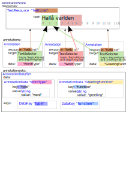

# Simple Stand-off Text Annotation Model

## Introduction

STAM is a data model for **simple stand-off text annotation**. The underlying
premise is that any information on a text is represented as an *annotation*. We
define an annotation as any kind of remark, classification/tagging on any
particular portion(s) of a text, or on to the resource or annotation set as a whole, in which case
we can interpret annotations as *metadata*. Additionally, rather than reference the
text directly, annotations may point to other annotations (higher-order
annotation). Examples of annotation may be linguistic
annotation, structure/layout annotation, editorial annotation, technical
annotation, or whatever comes to mind. Our model does not define any
vocabularies whatsoever.

The underlying resource is taken in its most bare form without further
information; e.g. plain text (an ordered sequence of unicode points). *Any*
additional information would be considered an annotation in our model.
Interpreting and supporting particular formats/encodings is up to the
implementations and opaque to the data model.

STAM does not depend on other more complex data models such as RDF, Web
Annotations, TEI, FoLiA or whatever, but instead addresses the problem from a
more functional and pragmatic perspective. We separate pragmatics from
semantics and define a kind of lowest common denominator upon which further solution can be built.
The user is free, and in fact encouraged, to use vocabularies that are formalised elsewhere.

STAM is primarily intended as a model for data representation, and less so as a format for data interchange.
It is designed in such as way that an efficient implementation (both speed & memory) is feasible. The form of such an
implementation either in a relational database, triple store, directly modelled in memory, is left open to the implementation.
Our model should also be reducible to a more generalised acyclic directed graph model without much difficulty.

Goals/characteristics of STAM are:

* *Simplicity* - the data model must be easy to understand for a
user/developer and use and only contain what is needed, not more. We provide a **minimal** foundation upon which other 
projects can build more complex solutions. These are deliberately kept out of STAM itself. The notion that *everything is an annotation* is at the core of STAM and one of the things that keeps it simple.

* *Separation from semantics* - The data model does not commit to any vocabulary or annotation paradigm. It must be
flexible enough to express whatever annotation paradigm a researcher wants to
use, yet provide the facilities to be specific enough for practical purposes.
The model basically allows for any kind of directed or undirected graph.

* *Standalone* - No dependency on other data models (e.g. RDF) aside from Unicode, no dependency on any software services.

* *Practical* - Rather than provide a theoretical framework, we primarily aim to provide a practical specification and actual low-level tooling you can get to work with right away.

* *Performant* - The data model is set up in such a way that it allows for efficient/performant implementations, with regard to processing requirements but especially memory consumption. The model should be suitable for big data (millions of annotations). 

* *Import & Export* - Reads/writes a simple JSON format. But also designed with export to more complex formats in mind (such as W3C Web Annotations / RDF) and imports from common formats such as CONLL. Note that although STAM puts no constraints on annotation paradigms and vocabularies, higher data models may.

The key words "MUST", "MUST NOT", "REQUIRED", "SHALL", "SHALL
NOT", "SHOULD", "SHOULD NOT", "RECOMMENDED",  "MAY", and
"OPTIONAL" in this document are to be interpreted as described in
RFC 2119.

## Data Model

In this section, we will describe the STAM data model, note that the data model is detached from any specific
serialisation format.

The below UML-like diagram expresses the data model.


Some notes to interpret the diagram:

*  A circled C stands for a Class (items listed are properties that must all be satisfied).
*  A circled A stands for a Abstract class (items listed are properties that must all be satisfied).
*  A circled E stands for an Enumeration (items listed are options in the enumeration)
   *  Enumerations may be parametrised (this could be expanded to an abstract class and concrete classes).
* Dashed edges follow private properties for the recommended memory-model
* Green edges denote a subclass relationship (for the various Selectors)
* Red edges point to references in the recommended memory model, black edges indicate ownership
* The ampersand prefix (``&``) represent a reference/pointer and is merely a *RECOMMENDED* hint for a memory model for implementations.
* The ``?`` suffix represents optional properties. 
*  ``[]`` represents a list/vector/array.
    *  The ``*`` suffix inside a list represents zero or more items of the preceding type
    *  The ``+`` suffix inside a list represents one or more items of the preceding type
* Properties starting with an underscore are *NOT REQUIRED* but *RECOMMENDED* for implementation to facilitate quick lookups, they suggest a memory model.


### Identifiers

Many of the items carry two identifiers. The first is a *private identifier*, an internal numeric identifier (starting
with an underscore) which serves for particular implementations but should not be used outside of the context of a
particular implementation.

The second main identifier is an actual *public identifier* intended to be persistent and usable for data exchange, this
is an arbitrary string and is *OPTIONAL*.

Both identifiers, by definition, *MUST* be unique.

The following overriding constraints apply only for compatibility RDF:

*  The public identifier *MUST* be an [IRI](https://datatracker.ietf.org/doc/html/rfc3987)
*  There *MUST* be a public identifier for each **Annotation**

### Offsets

Offsets are always in unicode codepoints (not byte offsets, though internally
implementations *MAY* convert from/to utf-8 byte offsets), the coordinate
system is zero-indexed and the end offset is non-inclusive.  An offset consists of two components:

1. `begin` - An cursor pointing to the begin of the selection
2. `end` - A cursor pointing to the end of the selection (non-inclusive)

The coordinate system is determined by whatever that the selector points at:
this can either be a `TextResource` via `ResourceSelector`, in which case we
are dealing with absolute coordinates in a text, or it can be an `Annotation`
via `AnnotationSelector` in which case we are dealing with relative coordinates
with respect to the target of the annotation.

The `begin` and `end` offsets are expressed via a `Cursor`, for either
component the cursor can be either begin-aligned or end-aligned. This is best
explained through an example on the string *"Hallå världen"* (Hello world in
swedish):

* ``BeginAligned(0), BeginAligned(1)`` - *"H"*
* ``BeginAligned(4), BeginAligned(5)`` - *"å"*
* ``BeginAligned(0), BeginAligned(5)`` - *"Hallå"*
* ``BeginAligned(0), BeginAligned(13)`` - *"Hallå världen"*
* ``BeginAligned(0), EndAligned(0)`` - *"Hallå världen"*
* ``BeginAligned(7), EndAligned(-2)`` - *"värld"*
* ``EndAligned(-7), EndAligned(0)`` - *"världen"*

Also take note of the following constraints:

* The `begin` and `end` offset *MAY* reference the very same point, in which case the length of the selection is ``0`` and the whole selector *SHOULD BE* interpreted as a single cursor rather than a selection.
* The `end` offset *MUST NOT* reference a point before the `begin` offset.
* The `begin` offset *MUST NOT* reference a point before the beginning of the resource's text.
* The `end` offset *MUST NOT* reference a point after the end of the resource's text.

### Example A

Example A below shows an annotation example using this model, it shows a
textual resource with a small a text *"Hallå världen"* with tree annotations.
Two annotations share the same data, illustrating how the model leads to more
memory efficiency.



### Class: Annotation Set

An Annotation Set is a collection of annotations. There is no intrinsic meaning in them being grouped together.  The
actual data of the annotation is also held by the AnnotationSet if the *RECOMMENDED* memory-model is followed. When serialising all annotations in the data model to
file, it usually takes place at this level.

### Class: Annotation

This represents a particular instance of annotation and is the central concept of the model. The instance of annotation
is decoupled from the *data* or value/label of the annotation (``AnnotationData``). After all, multiple instances can be annotated with the same
label (multiple annotations may share the same annotationdata). Moreover, an Annotation can have multiple annotation data associated.

Each annotation *MUST* have a single ``target``. The target is selected using a ``Selector``. It identifies the target and the part of
the target that the annotation applies to.  There are multiple types of selectors:

* ``TextSelector`` - Selects a target resource and a text span within it. The text span *MAY* be noncontiguous. The span
    is specified through one or more offset pairs consisting of a ``begin`` and ``end``.
  These ``begin`` and ``end`` attributes *MUST* describe the character position in NFC-normalised unicode
  points, in text of the resources that is being pointed at. Indexing *MUST* be zero-based and the end offset *MUST* be
  non-inclusive.
* ``ResourceSelector``  - A selector point to a resource as whole. These type of annotation can be interpreted as *metadata*.
* ``AnnotationSelector``  - A selector pointing to one or more other annotations (enables higher-order annotation). If the annotation that is being targeted eventually refers to a text (`TextSelector`), then offsets **MAY** be specified that select a subpart of this text. These offsets are now *relative* to the annotation (starting at 0, negative values allowed, end non-inclusive).
* ``MultiSelector``  - A selector that consists of multiple other selectors, used to select more complex targets that transcend the idea of a single simple selection. This *MUST* be interpreted as the annotation applying equally to the conjunction as a whole, its parts being inter-dependent and for any of them it goes that they *MUST NOT* be omitted for the annotation to makes sense. Note that the order of the selectors is not significant. When there is no dependency relation between the selectors, you *MUST* simply use multiple `Annotation`s instead.
* ``DirectedSelector``  - Another selector that consists of multiple other selectors, but with an explicit direction (from -> to), used to select more complex targets that transcend the idea of a single simple selection.

As said, the actual contents/value/body of the annotation (e.g. the tag/label/comment) is stored in a separate
``AnnotationData`` instance. This is done so multiple annotations with the exact same content require less storage
space, and to facilitate search.  We make no distinction between data and metadata here. 

Multiple instances of `AnnotationData` *MAY* be associated with an
`Annotation`, when this is the case, a strong dependency relation between the
instances *MUST* be assumed in the interpretation. The annotation would not be
complete without any of them. If this is not the case, you *SHOULD* use
multiple `Annotation`s instead, or most likely an`Annotation` on the `Annotation` (i.e.
a higher-order annotation via `AnnotationSelector`).

Let's look into `AnnotationData` in the next section:

### Class: AnnotationData

This stores the actual content of an annotation. It is decoupled from the actual ``Annotation`` instances so multiple
instances can point to the same content.

Annotations data consists of a single key/value pair. The ``key`` *MAY* for instance denote the
annotation type (none are predefined). Using a ``key`` is *RECOMMENDED* but *NOT REQUIRED* (it *MAY* be empty). 
A ``key`` *MUST* be globally unique. It is encapsulated in a separate ``DataKey`` type for performance reasons.

For a given AnnotationData instance, Key uniqueness is also *RECOMMENDED* but *NOT REQUIRED*, i.e. there *MAY* be multiple annotations on the same data with
identical keys.

The ``value`` property is a ``DataValue`` instance that holds the
actual value along with its data type. Additionally, a ``vocabulary`` property may refer to a ``Vocabulary`` that
defines what values are allowed.

The ``_referenced_by`` attribute of ``AnnotationData`` links back to all annotations that
instantiate this exact same content, this is effectively a reverse index to facilitate search. It is *OPTIONAL*.

### Class: DataKey

This ``DataKey`` class encapsulates data keys for AnnotationData. It has an
``id`` property, which identifies the key and  *MUST* be globally unique. The
reason for this separate class is only to enable performant implementation with
a minimal memory footprint; allowing the full key ID to be stored in memory only once.

It is *RECOMMENDED* to have an additional boolean property `indexed`, which
indicates whether implementations should or should not compute an index for
this key.

The following overriding constraints apply only for compatibility with RDF:

*  The public identifier *MUST* be an [IRI](https://datatracker.ietf.org/doc/html/rfc3987) identifying a property.

### Enum: DataValue

This ``DataValue`` class encapsulates data values along with their data types, as well as some collection types.
It can be set to one of the following:

* ``Null()`` - No value
* ``Id(value: str)`` - A public identifier (when used with RDF, this *MUST* be an IRI). This *MUST NOT* be used to refer to annotations in the STAM model.
* ``String(value: str)``- String
* ``Int(value: int)`` - Integer number
* ``Bool(value: bool)`` - Boolean
* ``Float(value: float)`` - Fractional number
* ``Datetime(value: datetime)`` - A date/time representation, compatible with ``xsd:datetime``.
* The following are recursive-types:
    * ``Set(value: [DataValue])`` - An unordered set of multiple ``DataValue`` instances
    * ``List(value: [DataValue])`` - An ordered list of multiple ``DataValue`` instances

Note that there is no ``Map`` type to associate further key, value pairs. If
you want to express nested relations, you *MUST* use `Annotation`s on
`Annotation`s (i.e. using `AnnotationSelector`).

## Serialisation Formats

### STAM JSON

The default JSON serialisation (STAM JSON) is the primary format for parsing and serialisation. It follows the in-memory implementation closely.
The serialisation *MUST* adhere exactly to the property names introduced in this document.

* Private properties (those starting with an underscore) *SHOULD NOT* be serialised (those are recomputed at parsing). 
* All STAM classes serialised as JSON objects *MUST* carry a ``@type`` attribute that references the STAM class as laid out in this specification. This helps readability and error detection.
* All public IDs are serialised through the ``@id`` attribute.

For a complete serialisation, you *SHOULD* start at the level of the `AnnotationStore`, which is the root level. 

In Example A1, shown below, we see the serialisation of the Example A that was shown before, 


```json
{
    "@type": "AnnotationStore",
    "@id": "Example A",
    "resources":  [{
        "@type": "TextResource",
        "@id": "hello.txt",
        "text": "Hallå världen"
    }],
    "annotationsets": [{
        "@type": "AnnotationSet",
        "keys": [
            {
                "@type": "DataKey",
                "@id": "type",
            },
            }
                "@type": "DataKey",
                "@id": "function",
            },
        ],
        "data": [
            {
                "@id": "WordType",
                "@type": "AnnotationData",
                "key": "type",
                "value": {
                    "@type": "String",
                    "value": "word"
                }
            },
            {
                "@id": "GreetingFunction",
                "@type": "AnnotationData",
                "key": "function",
                "value": {
                    "@type": "String",
                    "value": "greeting"
                }
            }
        ],
        "annotations": [{
                "@type": "Annotation",
                "data": ["WordType"],
                "target": {
                    "@type": "TextSelector",
                    "resource": "hello.txt",
                    "offsets": {
                        "begin": {
                            "@type": "BeginAligned",
                            "value": 0 
                        },
                        "end":  {
                            "@type": "BeginAligned",
                            "value": 5 
                        },
                    },
                }
            },
            {
                "@type": "Annotation",
                "data": ["WordType"],
                "target": {
                    "@type": "TextSelector",
                    "resource": "hello.txt",
                    "offsets": {
                        "begin": {
                            "@type": "BeginAligned",
                            "value": 6 
                        },
                        "end":  {
                            "@type": "BeginAligned",
                            "value": 13
                        },
                    },
                }
            },
            {
                "@type": "Annotation",
                "data": ["WordType"],
                "target": {
                    "@type": "TextSelector",
                    "resource": "hello.txt",
                    "offsets": {
                        "begin": {
                            "@type": "BeginAligned",
                            "value": 0 
                        },
                        "end":  {
                            "@type": "EndAligned",
                            "value": 0 
                        },
                    },
                }
            },
         ]
    }],
}
```

Serialisation relies on the availability of identifiers. When identifiers are
not assigned, implementations *MUST* assign arbitrary identifiers if and only
if the instances are referenced from elsewhere.

Fields that are references (denoted by the & and red edges in the UML schema
earlier), simple take the public identifier as value. However, you *MAY* also
specify the target in-line as if it were not a reference. This provides some extra flexibility 
Parser implementations *MUST* support this. Consider an excerpt of the first annotation, functionally identical to before, but `data` and `key` have now been specified in-line:

```json
{
    "@type": "Annotation",
    "data": [
        {
            "@id": "WordType",
            "@type": "AnnotationData",
            "key": {
                "@type": "DataKey",
                "@id": "type",
            },
            "value": {
                "@type": "String",
                "value": "word"
            }
        },
    ],
    "target": {
        ...
    }
}
```

As this may create redundancy/unnecessary duplication, it *SHOULD* only be used
in cases where a reference is not needed. However, parser implementations *MUST* accept
redundancy if and only if there are no collisions (a thing with the same ID
described differently than before), if there are collisions, implementations
*MUST* produce an error.

Rather than have one big json file with everything, serialisations *SHOULD* be
split over multiple files, it is *RECOMMENDED* to have separate files for each
annotation set and to keep the text resources in external
files. References to files are made by using they key ``@include``, consider the
Example A2 where the annotation store references external files.


```json
{
    "@type": "AnnotationStore",
    "@id": "Example A",
    "resources":  [{
        "@include": "hello.txt"
    }],
    "annotationsets": [{
        "@include": "my.annotationset.json"
    }]
}
```

These ``@include`` statements *MUST* be `json` files *except* when used inside
`resources`; in that case plain-text files *SHOULD* be used and *MUST* be assumed
if the filename does not carry a ``json`` extension. All files to be included *MUST* be encoded as UTF-8.
This will translate to `TextResource`s with the filename as ID. Relative filenames in `@include`
statements are interpreted as the implementation sees fit, usually relative
to the current working directory or some document root directory. Absolute
filenames *MUST* be absolute on the filesystem but *MAY* be rejected by implementations. The `@include` statements *MAY*
also reference full URLs, but implementations are *NOT REQUIRED* to
implement networking logic and *MAY* reject this (it has security implications). Implementations *SHOULD*
make clear whether they support fetching remote URLs or not. The
``@include`` statements *MAY* occur at any level where a ``@type`` or
``@id`` is expected, they *MUST NOT* occur on other levels.

Implementations *SHOULD* implement the necessary bookkeeping logic in their
parsers to serialize to the same separate stand-off files as were parsed.

**Note:** Some readers will notice that the use of ``@type`` and ``@id`` are similar to their usage in JSON-LD. It has to be noted though that
the default JSON serialisation is not proper JSON-LD, but if certain constraints are adhered to it can be easily made to be valid JSON-LD, see the next section:

### JSON-LD / Turtle / RDF

Though STAM explicitly does not depend on RDF; when some extra constraints are
adhered to (that have been indicated throughout this specification), a STAM
model can be expressed in RDF terms. This opens up connectivity with the linked
open data world. Implementations that export to RDF *MUST* check whether the
constraints for RDF export are adhered too, and *MUST NOT* blindly assume so.

An RDF model and JSON-LD context will be formulated for STAM. Including this
JSON-LD `@context` in the STAM JSON files (assuming constraints are adhered
too) will then make it JSON-LD and therefore RDF. 

### W3C Web Annotations

Conversion to the W3C Web Annotation model is up to specific tooling and
requires adherence to the same constraints as RDF. Do note that there are
certain things in STAM that are not easily expressed in web annotations  (or not as concisely).
The reverse also holds, web annotations can often not be expressed in STAM directly.

### Binary

JSON is verbose and parsing and serialisation is fairly slow. Optimized binary
serialisations for STAM are conceivable. These are parsed and serialised considerably
quicker than any other and are the *RECOMMENDED* solution in situations where
quick reading/writing from/to disk is important. However, such serialisations
*SHOULD* be consider implementation-specific and *MUST NOT* serve as
interchange or archiving formats.

### STAM TSV/CSV

Though STAM is a simple minimalistic model, the JSON serialisation still has a
verbosity and complexity that makes it hard to work with for the less-technical
researcher.

A lightweight TSV/CSV format will be proposed that can represent a fair subset of STAM.

## Relation to other data models & motivations

In this section I'll draw some parallels with other data models. Rather than draw on existing data models, especially
those in the realm of Linked Open Data, I have opted to not adopt any of those. The reason is that I wanted a simpler and more
pragmatic stand-alone solution that has the right amount of expressivity that is precisely tailored to the task of stand-off
annotation, *and not much more*.

My arguments for this are:

* I don't want to burden the user with having to learn many different and often highly complex models as a
  prerequisite to understanding the actual one they are interested in.
* I don't want implementations to have to rely on huge (and not always mature) 3rd party dependencies for such
  data models. A STAM implementation should be realistic with one main code base, needing only some well-established libraries like a
  generic JSON parser/serialiser, but requiring no further infrastructure.
* Existing standards like Web Annotations (in turn making use of JSON-LD and RDF) contain features that go well beyond
  what is needed for simple stand-off annotation, and are similarly still lacking certain features we do need for certain annotation scenarios.
* Existing models like RDF, Web Annotations tend to be very verbose and have more overhead, making performant
  processing more complicated. Though RDF is something we explicitly target as an export option, it is not a dependency.

STAM is more like a lowest common denominator, a pivot model if you will, that allows expression of a wide variety of
annotation paradigms. Exports of this simpler data model to more expressive and established standards like RDF and
WebAnnotations are encouraged whereever appropriate.

Comparisons can also be drawn with more specific-purpose text annotation
formats or such as TEI, FoLiA, TCF, and NAF, all of which are XML-based formats
which offer very specific annotation types. Comparisons can also be drawn with
more generic frameworks such as Text Fabric, Salt, and GraF (LAF). In STAM, all
of those would be user-defined,  it should be possible to reformulate some of
these data model in terms of STAM.

## Extensions

We keep STAM simple and define only the bare minimum. Other functionality is included in extensions. The following are defined:

* [STAM-Vocab](extensions/stam-vocab) -  Allows expressing and validating against user-defined vocabularies.

Implementations *SHOULD* explicitly state which extensions they support.

## Implementations

This specification does not define how the data model should be implemented in software. We refer to the following implementations:

* None exists yet
