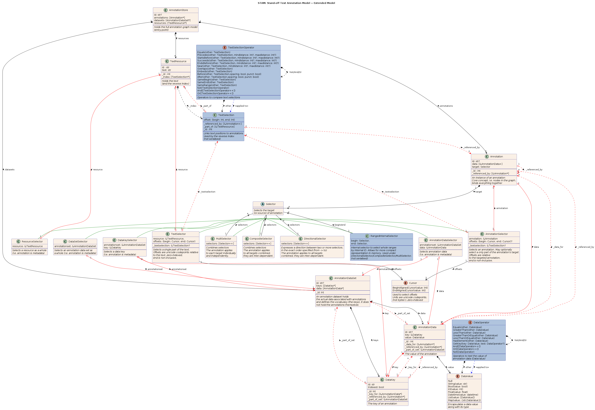

# Simple Text Annotation Model

## Introduction

STAM is a simple data model for stand-off text annotation.

Our aim with STAM is to lay a simple but strong foundation for **stand-off annotations on text**. We define an *annotation*
as any kind of remark, classification/tagging on any particular portion(s) of the text, although we do also allow
annotations to not point to any particular part of the text, in which case they are considered *metadata*.  Examples of
annotation may be linguistic annotation, editorial annotation, technical annotation, or whatever comes to mind. OUr
model does not define the vocabularies, it merely defines a model so *you* can define your own vocabularies and a model in
which you can express your annotations using your own vocabularies.

*Simplicity* is the keyword, the data model must be easy to understand and use and only contain what is needed, not
more. STAM does not depend on other more complex data models such as RDF, Web Annotations, TEI, FoLiA or whatever, but
instead addresses the problem from a more functional and pragmatic perspective. We separate pragmatics from semantics.
The data model is also designed in such as way that an efficient implementation (both speed & memory) is feasible.

We do focus on a high degree of interoperability with richer models, most notably the W3C Web Annotation Model. Most of
what we can express in STAM can also be expressed as a web annotation, but there are some constraints here.

Goals/Features:

 * Stand-off annotation on plain text
 * Simple and minimal; no unnecessary abstractions/complexity/formality
 * No commitment to any annotation paradigm aside from stand-off annotation, the model basically allows for any kind of directed or
   undirected graph.
 * Interoperability without dependency:
    * Self-sustained; STAM does not rely on other data models (e.g. RDF) that introduce additional complexity.
    * Exportable to webannotations (subject to some constraints)
    * Import from webannotations (within various constraints)
 * Separation from semantics: the data model does not commit to any vocabulary or annotation paradigm.

Later goals (for an extension):

 * Semantics: the data model allows expressing semantics and checking compliance against a specific
   user-defined formalism.
   STAM does not define the semantics, instead:
     * Usable with user-defined vocabularies, full separation between underlying and data model and vocabularies
     * Usable with user-defined annotation paradigms
 * Validation: The ability to validate annotations of the data and basic correctness is one of the core goals of the
     model: Users (and systems) make mistakes, correctness of the data has to be ensured.

The key words "MUST", "MUST NOT", "REQUIRED", "SHALL", "SHALL
NOT", "SHOULD", "SHOULD NOT", "RECOMMENDED",  "MAY", and
"OPTIONAL" in this document are to be interpreted as described in
RFC 2119.

## Data Model

In this section, we will describe the STAM data model, note that the data model is detached from any specific
serialisation format. Usually, the default serialisation will be JSON, in which case class in the data model
can be instantiated as a JSON object.

The below UML-like diagram expresses the data model.



Some notes to interpret the diagram:
*  A circled C stands for a Class (items listed are properties that must all be satisfied).
*  A circled E stands for an Enumeration (items listed are options in the enumeration)
   *  Enumerations may be parametrised (technically a union of an enumeration and a struct/class).
*  The ampersand (``&``) represent a reference/pointer. The details of the implementation are not prescribed though.
*  ``Option<>`` represents optional properties. ``Map<>`` represents a key/value map/dictionary.
*  ``[]`` represents a list/vector/array.

### Identifiers

Many of the items carry two identifiers. The first is a *private identifier*, an internal numeric identifier which serves for particular
implementations but should not be used outside of the context of a particular implementation. It serves as the primary
identifier and is *REQUIRED*, but it is transparent and automatically derivable by the implementation.  In the diagram above, we
use an leading underscore for this type of ID.

The second identifier is an actual
*public identifier* intended to be persistent and usable for data exchange, this is an arbitrary string and is *OPTIONAL*.

Both identifiers, by definition, *MUST* be unique.

The following overriding constraints apply only for compatibility with Web Annotations:

*  The public identifier *MUST* be an [IRI](https://datatracker.ietf.org/doc/html/rfc3987)
*  There *MUST* be a public identifier for each **Annotation**

### Class: Annotation Set

An Annotation Set is a collection of annotations. There is no intrinsic meaning in them being grouped together. The set
*MUST* be ordered, but this too is without intrinsic meaning.

### Class: Annotation

This represents a particular instance of annotation. The target of the annotation is indicated by the ``selector``
property, which in turn one of takes three forms:

* A selector on the entire target resource rather than any particular portion of the text. This means
  the annotation *SHOULD* be interpreted as metadata.
* A selector on a particular range of the target text, indicated by offsets.
  The ``begin`` and ``end`` attributes *MUST* describe the character position in NFC-normalised unicode
  points, relative to the data referenced by the  ``resource_id`` property of the selector. Indexing *MUST* be zero-based and the end offset *MUST* be
  non-inclusive and therefore larger than the begin offset.
* A selector pointing to another annotation rather than directly to the text. This effectively enables
  *higher-order annotation* (annotations on annotations). If an annotation A has a selector pointing to annotation B,
  then annotation B *MUST* have annotation A included in its ``references`` property.

The ``selector`` of the annotation identifies the target and the part of
the target that the annotation applies to. There *MAY* be multiple selectors and there *MUST* be at least one.

The actual contents/value/body of the annotation (e.g. the tag or comment) is stored in a separate ``AnnotationData`` instance. This is done so
multiple annotations with the exact same content require less storage space, and to facilitate search. Any further
metadata on the annotation is similarly stored in ``AnnotationData`` instances. We make no distinction between data and
metadata. Let's look into this:

### Class: AnnotationData

This stores the actual content of an annotation. It is decoupled from the actual ``Annotation`` instances so multiple
instances can point to the same content. The ``instances`` attribute of ``AnnotationData`` links to all annotations that
instantiate this exact same content.

The actual value of the data is represented by the ``data`` property, which is a ``DataValue`` instance that holds the
actual value along with its data type.

The ``type`` of the annotation data also can be specified, this pertains to the type of the annotation. These types are
not predefined by our data model, but are usually made in reference to some external vocabulary.

AnnotationData is used both for


For compatibility with Web Annotations, the use of the following type strings with ``Meta`` is *RECOMMENDED*. See the
[web annotation model](https://www.w3.org/TR/annotation-model/#other-properties) for further details, such as the
cardinality for each of these metadata items.

* ``creator`` - The data value represents the agent responsible for creating the resource. This may be either a human, an organization or a software agent.
* ``created`` - The time at which the resource was created.
* ``generator`` - The agent responsible for generating the serialization of the Annotation.
* ``generated`` - The time at which the Annotation serialization was generated. The
* ``modified`` - The time at which the resource was modified, after creation.
* ``audience`` - The intended audience for the annotation
* ``accessibility`` - The accessibility of the annotation
* ``motivation`` - The reason why the annotation was created
* ``rights`` - The license for the annotation


### Enum: DataValue

This ``DataValue`` class encapsulates data valus along with their data types, as well as some collection types.
It can be set to one of the following:

* ``Id(v: str)`` - A public identifier (when used with Web Annotations, this *MUST* be an IRI)
* ``String(v: str)``
* ``Int(v: int)``
* ``Float(v: float)``
* ``Datetime(v: datetime)`` - A datetime representation, compatible with ``xsd:datetime``.
* ``Annotation(annotation: &Annotation)`` - A reference to another annotation
* The following are recursive-types:
    * ``Map(v: Map<DataKey,DataValue>)`` - A key, value map; this enables arbitrarily nested key/value pairs. The values are ``DataValue`` instances,
        the keys are arbitrary strings.
    * ``List(v: [DataValue])`` - A list of multiple ``DataValue`` instances


Attributes:

* ``id`` - Unique Id for the annotation (optional)
* ``begin`` - Selector begin character position in the text (optional, absence denotes metadata/higher-order annotation)
* ``end`` - Selector end character position in the text (optional, absende denotes metadata/higher-order annotation)
* ``text`` - Text value of the pointed text (optional, for validation purposes)
* ``type`` -  URL to the vocabulary used in the body (or in-line definition)
* ``body`` - The body of the annotation, a scalar value or a key/value map (optional)

The ``id`` attribute is *OPTIONAL* but *RECOMMENDED*. It is an identifier uniquely identifying an annotation. The value
it is given is an arbitrary identifier (a string) which must be unique for the entire annotation set, it is
*RECOMMENDED* for it be even globally unique even over multiple annotation sets. No further contraints are set on the
format of identifiers for STAM, but different serialisations/export options *MAY* posit additional constraints, as such
it is *RECOMMENDED* to stick to basic alphanumeric characters.


The ``text`` attribute is *OPTIONAL* but *RECOMMENDED*. When used, its value *MUST* be a
copy of the exact same text string as the ``begin`` and ``end`` attributes point to. This is
merely an extra reduncancy level to ensure correctness and aid interpetability.
It is used in validation and tools *SHOULD* be able to automatically derive it
if not explicitly supplied.

The ``body`` attribute provides the body of the annotation, i.e. the actual
values associated with the annotation.  The ``body`` attribute *MAY* be omitted
entirely if there is no need to associate any values with the annotation. If a
body value is provided, it can be either a simple primitive such a a
string/integer/float or boolean, or an actual key/value map. The latter allows
you to associate multiple values with the annotation and to relate the values
to a vocabulary.

The ``type`` attribute, if provided, *MUST* point to a URL describing a **vocabulary set**. It *MAY* be a list of
multiple vocabulary sets, all of which will apply equally and *MUST NOT* have any conflicting terms.  If provided, all
keys and values in the ``body`` *MUST* comply to the referenced vocabulary.  Providing a type/vocabulary is
*RECOMMENDED* but *NOT REQUIRED*. Only the bodies of typed annotations can be validated.  If no vocabulary is provided,
the key/value map of ``body`` *MAY* contain anything and is completely unchecked, corresponding to the simplest
**Untyped annotation** level. This may be desireable in some pragmantic ad-hoc contexts and
allows users to use STAM at the level of abstraction they are comfortable with. Untyped annotations are simpler,
but less expressive.

It is possible that an annotation can not be interpreted by itself but relies on other annotations
for a full interpretation. In such cases, the body of the annotation *SHOULD* have a key that refers to the ID of
one or more another annotation. It is up to the vocabulary used to defined this.

### Vocabulary Set

Attributes:

* ``base`` - A list of zero or more other vocabulary sets to import (URLs), this offers some modularity.
    * (TODO: describe how conflicts are handled)
* ``terms`` - An unordered list of **vocabulary terms**

The vocabulary set defines a vocabulary. The vocabulary set essentialy forms the type of the annotation. The
``type`` attribute of an annotation *MUST* point to the URL of a vocabulary set. Vocabulary sets form the second level of
abstraction/complexity/formalism of STAM; **Typed Annotation**, and are therefore *NOT REQUIRED*.

### Vocabulary Item

Attributes:

* ``key`` - An identifier, the string *MUST* be unique at the level which it is specified. The key *MUST NOT* contain any slashes.
* ``type`` - The datatype for this key; all types start with ``@`` to distinguish them from closed-vocabulary options.. (The maximum size
         of the primitive data types is not strictly defined and *MAY* be determined by the impelmentation)
    * An array of specific values, this defines the closed vocabulary
    * A map of key/value pairs (object in JSON's nomenclature), indicating that this is a nested type
    * ``@idref`` - A reference to another annotation
    * ``@idrefs`` - A list of references to another annotation
    * ``@vocab`` - A URL or list of URLs referring to another vocabulary. This implies nesting: the value for this key is  a map of key/value pairs who adhere to a different vocabulary.
    * ``@url`` - A URL
    * ``@urllist`` - A URL list
    * ``@uri`` - A URI or IRI
    * ``@urilist`` - A URI or IRI list
    * ``@str`` - A string
    * ``@strs`` - A string list
    * ``@int`` - An integer
    * ``@ints`` - An integer list
    * ``@float`` - A floating point number
    * ``@floats`` - A floating point list
    * ``@date`` - A date
    * ``@datelist`` - A date list
    * ``@datetime`` - A date-time combination
    * ``@datetimelist`` - A datetime list
    * Any other value is a fixed static value that will be assigned, if the key does not exist in this case, it will be created.
* ``constraints`` - Extra **vocabulary constraints** on the data type, specified as list of key/value pairs:
    * ``minvalue`` - mininum numeric value (inclusive)
    * ``maxvalue`` - maximum numeric value (inclusive)
    * ``default`` - a default value in case this element is not specified
    * ``allowunknown`` - Allow out of vocabulary items even when a closed vocabulary is specified (default: false)
    * ``required`` - boolean indicating whether this field is required (default: false)
    * ``conflicts`` - A list of keys which *MUST NOT* not be used at the same time as this key, to match against
        higher/deeper levels, use path syntax like ``../`` , ``key/childkey``.
    * ``requires`` - A list of keys which *MUST* be used at the same time as this key
    * ``minlength`` - Minimum length of the list (for all the ``@list`` datatypes).
    * ``maxlength`` - Maximum length of the list (for all the ``@list`` datatypes).

### Query

The STAM data model also defines a query data object that can be used to query an annotation set. A query typically returns
zero or more annotations that match against the criteria you provided.

This object is either simply a **Filter** object, or an ordered list of **Filter** objects. When multiple filters are specified, they are applied in succession on the output of the previous filter (like a pipe).

### Filter

A filter is a condition for matching annotations.

Attributes, all of them are optional, but at least one *MUST* be specified:

* ``id``: A filter on the ID. (You can use the operators we explain in the next item)
* ``body``: A filter on the annotation body. A map of keys and values, in which they keys match against the keys in the body of potential
    annotations; or the key is an operator:
    * ``@and`` - Value is a list
    * ``@or`` - Value is a list
    When matching keys, the value can be another object with an
    *operator* as key. We distinguish the following operators:
    * ``@equals`` - Exact match (you usually don't need this operator as it is the default if you just specify a
        key/value pair).
    * ``@not_equals``  - Does not match
    * ``@contains``  - is part of the list
    * ``@not_contains``  - is not part of the list
    * ``@greater_than`` - Value is a number
    * ``@less_than`` - Value is a number
    * ``@greater_equal_than`` - Value is a number
    * ``@less_equal_than`` - Value is a number
    You may also use the following special values to simply check whether a key exists or not:
    * ``@undefined`` - The key is not present in the annotation
    * ``@defined`` - The key is present in the annotation.
* ``type``: A selector on the type. Uses the same operators as above.
* ``begin``: Begin offset (optional). Uses the same operators as above.
* ``end``: End offset (optional). Uses the same operators as above.
* Rather than the above attributes, the operators ``@and`` and ``@or`` may also be used at this level.


An example using JSON should explain things better:

```json
{
    "body": {
        "confidence": { "@greater_than": 0.5 },
        "@and": {
            "pos": "NOUN",
            "lemma": "house",
            "semrole": "@defined"
        }
    }
}
```

Note that all keys and values in this body, except those starting with ``@`` are fictitious and depend on the vocabulary used.


### Constraint Set

The Constraint Set, aka the model type, is a fairly high-order definition that lays contraints on how various types/vocabularies can be
used together. It is the third and highest-level abstraction in STAM, and is *NOT REQUIRED*. This concept should not be
confused with the **vocabulary constraints** that can be expressed at the vocabulary level.

Say you have an annotation type for "word" (a proper URL pointing to a vocabulary). One characteristic of words is
that they normally can't overlap. This constraint can not be captured in the vocabulary definition as it is a relation between types (i.e. between a
word and another word, it doesn't matter that the two types are identical). The model type specification is designed to such express such constraints.

Another example, if you have an annotation type "Sentence" and an annotation type "Word", you can define that a sentence
should contain at least one word. Or that a word may have only one Part-of-Speech tag, or that two Named Entities may
never overlap, etc...

Attributes:

* ``constraints`` - Ordered list of **Constraints**

### Constraints

Attributes:

* ``subject`` - A **Query** that selects the subject of the constraint.
* ``require`` - List of all the requirements for this subject. See next item
* ``forbid`` - List of all the prohibitions for this subject. Each requirement/prohibition is an object with the
    following keys. The value is another query that selects the object.
    * ``exists`` - True when both subject and object exist (e.g. there are match annotations for both)
    * ``sametext`` - True when both subject and object cover the exact same text
    * ``overlaps`` - True when there is overlap between subject and object in the text
    * ``preceeds`` - True when the subject comes before the object in the text (there are no annotations in between)
    * ``succeeds`` - True when the subject comes after the object in the text (there are no annotations in between)
    * ``contains`` - True when the subject contains the object (the offset of the object is entirely contained within
    * the subject)
    * ``contains_once`` - True when there is only one
    * ``contains_multiple`` - True when there are more than one


Consider the following JSON serialisation as example, this states that a sentence must contain at least one word and
that a sentence can't be part of another sentence.

```json
{
    "subject": {
        "type": "https://example.org/sentence.vocab.json"
    },
    "require": [{
        "contains": {
            "type": "https://example.org/word.vocab.json"
        }
    }],
    "forbid": {
        "contains": {
            "type": "https://example.org/sentence.vocab.json"
        }
    }
}
```

It is *RECOMMENDED* to many requirements and prohibitions as much as possible under one subject.
Implementations *MAY* be more performant then. Note that there is no guarantee on the order of evaluations. All
requirements and prohibitions *MUST* be satisfied for the constraint as a whole to pass validation.

Consider another example that also matches on the annotation body, here we demand that all words have a part of speech
tag with a confidence value of 0.5 or higher:

```json
{
    "subject": {
        "type": "https://example.org/word.vocab.json"
    },
    "require": [{
        "contains": {
            "type": "https://example.org/partofspeech-brown.vocab.json",
            "body": {
                "confidence": { "@greater_equal_than": 0.5 }
            }
        }
    }]
}
```


## Serialisation and file structure

STAM *SHOULD* be serializable to, and parsable from, at least JSON. Other serialisation format such as YAML, TOML or XML *MAY* also be supported
. We take JSON to be the canonical serialisation and exchange format as it is simple, well-known, and a wide variety of parsers is already available.

Annotation sets, vocabulary sets, and constraint set *SHOULD* all be written to separate files. We suggest the following file structure and
extension names:

- ``*.annotations.json`` for annotation sets
- ``*.vocabulary.json`` for vocabulary sets
- ``*.constraints.json`` for constraint sets

Due to the strict stand-off nature, the text content is always a separate file. The annotation set by definition offers all the
necessary information to find the other files (vocabulary, constraints, and target text).

If you publish any raw STAM data that is not overly large on disk, you can keep the files together under a version
control system like git. As an alternative for distribution, the files may be shipped together in a (possibly compressed)
archive.

## Relation to other data models

In this section I'll draw some parallels with other data models. Rather than draw on existing data models, especially
those in the realm of Linked Open Data, I have opted to not adopt any of those. The reason is that I wanted a simpler and more
pragmatic stand-alone solution that has the right amount of expressivity that is precisely tailored to the task of stand-off text
annotation, *and not much more*.

My arguments for this are:

* I don't want to burden the user with having to learn many different and often highly complex models as a
  prerequisite to understanding the actual one they are interested in.
* I don't want STAM implementations to have to rely on huge (and not always mature) 3rd party dependencies for such
  data models. A STAM implementations should be realistic with one main code base, needing only some well-established libraries like a
  generic JSON/YAML parser, but requiring no further infrastructure.
* Existing standards like Web Annotations (in turn making use of JSON-LD and RDF) contain features that go beyond
  what is needed for simple text annotation.
* Existing standards like RDF, Web Annotations tend to be very verbose and have more overhead, making performant
  processing more complicated.

STAM is more like a lowest common denominator, a pivot model if you will, that allows expression of a wide variety of
annotation paradigms. Exports of this simpler data model to more expressive and established standards like RDF and
WebAnnotations are encouraged whereever appropriate.

Web annotations are probably the closest to STAM when it comes to annotations, and an excellent export option. Web
annotations themselves offer more expressivity (e.g. all the different selectors and target types they support) than we
need for our purposes. On the other hand, Web Annotations themselves do not cover certain areas that we do cover with
STAM, such as the expression of vocabulary, constraints and focus of the validation. Being Linked Data, such options
are of course available for Web Annotations and RDF too, but you quickly need to turn to full-blown OWL ontologies to accomplish
that. This I consider a dependency with considerable overhead and a steep learning curve.

Comparisons can also be drawn with more specific-purpose text annotation formats or such as TEI, FoLiA (disclaimer: I'm also the author
of FoLiA), TCF, and NAF, all of which are XML-based formats which offer very specific annotation types. In STAM, all of those
would be user-defined, so the aim is to reformulate some of these data models (notably FoLiA) in terms of STAM.

(TODO: Text Fabric, LAF, Salt.)


## Implementations

This specification does not define how the data model should be implemented in software. We refer to the following implementations:

* None exists yet

