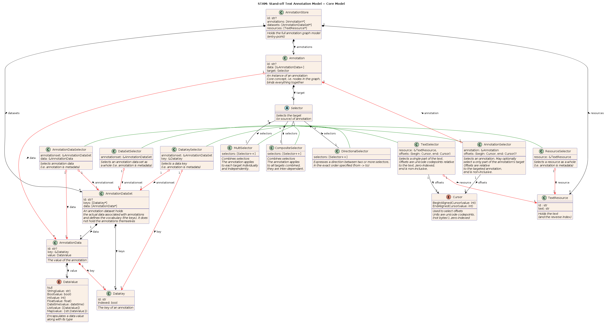

# STAM: Stand-off Text Annotation Model

## Introduction

STAM is a data model for **stand-off text annotation**. The underlying premise
is that any information on a text is represented as an *annotation*. We define
an annotation as any kind of remark, classification/tagging on any particular
portion(s) of a text, or on the resource or annotation set as a whole, in which
case we can interpret annotations as *metadata*. Additionally, rather than
reference the text directly, annotations may point to other annotations
(higher-order annotation). Examples of annotation may be linguistic annotation,
structure/layout annotation, editorial annotation, technical annotation, or
whatever comes to mind. Our model does not define any vocabularies whatsoever.

The underlying resource is taken in its most bare form without further
information; e.g. plain text (an ordered sequence of unicode points). *Any*
additional information would be considered an annotation in our model.
Interpreting and supporting particular formats/encodings is up to the
implementations and opaque to the data model.

STAM does not depend on other more complex data models such as RDF, W3C Web
Annotations, TEI, FoLiA or whatever, but instead addresses the problem from a
more functional and pragmatic perspective. We separate pragmatics from
semantics and define a kind of lowest common denominator upon which further
solution can be built. The user is free, and in fact encouraged, to use
vocabularies that are formalised elsewhere.

STAM is primarily intended as a model for data representation, and less so as a
format for data interchange. It is designed in such as way that an efficient
implementation (both speed & memory) is feasible. The form of such an
implementation either in a relational database, triple store, directly modelled
in memory, is left open to the implementation. Our model should also be
reducible to a more generalised acyclic directed graph model without much
difficulty.

Goals/characteristics of STAM are:

* *Simplicity* - the data model must be easy to understand for a user/developer
  to use and only contain what is needed, not more. We provide a **minimal**
  foundation upon which other projects can build more complex solutions. These
  are deliberately kept out of STAM itself. The notion that *everything is an
  annotation* is at the core of STAM and one of the things that keeps it
  simple.

* *Separation from semantics* - The data model does not commit to any
  vocabulary or annotation paradigm. It must be flexible enough to express
  whatever annotation paradigm a researcher wants to use, yet provide the
  facilities to be specific enough for practical purposes. The model basically
  allows for any kind of directed or undirected graph.

* *Standalone* - No dependency on other data models (e.g. RDF) aside from
  Unicode and JSON for serialisation, no dependency on any software services.

* *Practical* - Rather than provide a theoretical framework, we primarily aim
  to provide a practical specification and actual low-level tooling you can get
  to work with right away.

* *Performant* - The data model is set up in such a way that it allows for
  efficient/performant implementations, with regard to processing requirements
  but especially memory consumption. The model should be suitable for big data
  (millions of annotations). We sit at a point where we deem to have an optimal
  trade-off between simplicity and performance.

* *Import & Export* - Reads/writes a simple JSON format. But also designed with
  export to more complex formats in mind (such as W3C Web Annotations / RDF)
  and imports from common formats such as CONLL. Note that although STAM puts
  no constraints on annotation paradigms and vocabularies, higher data models
  may.

The name STAM, an acronym for *"Stand-off Text Annotation Model"*, is Dutch,
Swedish, Afrikaans and Frisian for *"trunk"* (as in the trunk of a tree), the
name itself depicts a solid foundation upon which more elaborate solutions can be built.

Large parts of this specification are normative:

The key words "MUST", "MUST NOT", "REQUIRED", "SHALL", "SHALL
NOT", "SHOULD", "SHOULD NOT", "RECOMMENDED",  "MAY", and
"OPTIONAL" in this document are to be interpreted as described in
[RFC 2119](https://www.rfc-editor.org/rfc/rfc2119).

## Extensions

We keep STAM simple and define only the bare minimum. Other functionality is
included in extensions. Extensions do one or more of the following: they extend
data model, specify new serialisations, specify mappings/crosswalks to other
paradigms/formats, specify additional functionality

The following are currently defined:

* [STAM-Vocab](extensions/stam-vocab) -  Allows expressing and validating against user-defined vocabularies.
* [STAM-Webannotations](extensions/stam-webannotations) - Models W3C Web Annotations using STAM and vice versa.
* [STAM-Textvalidation](extensions/stam-textvalidation) - Adds an extra redundancy layer that helps protecting data integrity and aids readability of serialisations 

Implementations *SHOULD* explicitly state which extensions they support.

## Implementations

This specification does not define precisely how the data model should be
implemented in software, although its data model is designed in such a way as
to facilitate an efficient implementation. We refer to the following
implementations:

* (None exists yet)

Please read the [Functionality](#Functionality) section further down to see a
specification of requirements for implementations.

## Core Data Model

In this section, we will describe the STAM data model, note that the data model is detached from any specific
serialisation format, those will be discussed in a later section.

The below UML diagram expresses the core data model.



Some notes to interpret the diagram:

*  A circled C stands for a Class (items listed are properties that must all be satisfied).
*  A circled A stands for a Abstract class (items listed are properties that must all be satisfied).
*  A circled E stands for an Enumeration (items listed are options in the enumeration)
   *  Enumerations may be parametrised (this could be written more verbosely as an abstract class (A) and concrete classes (C), and vice versa).
* Green edges denote a subclass relationship (for the various Selectors)
* Red edges point to references in the recommended memory model, black edges indicate ownership. Please ignore it on a first reading.
* The ampersand prefix (``&``) represent a reference/pointer and is merely a *RECOMMENDED* hint for a memory model for implementations.
* The ``?`` suffix represents optional properties. 
*  ``[]`` represents a collection (a list/vector/array/set, specifics are left to the implementation)
    *  The ``*`` suffix inside a list represents zero or more items of the preceding type
    *  The ``+`` suffix inside a list represents one or more items of the preceding type
    *  The ``++`` suffix inside a list represents two or more items of the preceding type

### Identifiers

Many of the items carry two identifiers. The first is an actual *public identifier* intended to be persistent and usable for data exchange, this
is an arbitrary string and is *OPTIONAL*.

The second is a *private identifier*, an internal numeric identifier (starting
with an underscore) which serves for particular implementations but should not be used outside of the context of a
particular implementation. It is part of the *extended model* rather than the *core model*.

Both identifiers, by definition, *MUST* be unique, though the private identifiers need only be unique within a certain implementation context.

The following overriding constraints apply only for compatibility RDF:

*  The public identifier *MUST* be an [IRI](https://datatracker.ietf.org/doc/html/rfc3987)
*  There *MUST* be a public identifier for each **Annotation**

### Offsets

Offsets are always in unicode codepoints (not byte offsets, though internally
implementations *MAY* convert from/to utf-8 byte offsets), the coordinate
system is zero-indexed and the end offset is non-inclusive.  An offset consists of two components:

1. `begin` - An cursor pointing to the begin of the selection
2. `end` - A cursor pointing to the end of the selection (non-inclusive)

The coordinate system is determined by whatever that the selector points at:
this can either be a `TextResource` via `ResourceSelector`, in which case we
are dealing with absolute coordinates in a text, or it can be an `Annotation`
via `AnnotationSelector` in which case we are dealing with relative coordinates
with respect to the target of the annotation.

The `begin` and `end` offsets are expressed via a `Cursor`, for either
component the cursor can be either begin-aligned or end-aligned. This is best
explained through an example on the string *"Hallå världen"* (Hello world in
swedish):

* ``BeginAlignedCursor(0), BeginAlignedCursor(1)`` - *"H"*
* ``BeginAlignedCursor(4), BeginAlignedCursor(5)`` - *"å"*
* ``BeginAlignedCursor(0), BeginAlignedCursor(5)`` - *"Hallå"*
* ``BeginAlignedCursor(0), BeginAlignedCursor(13)`` - *"Hallå världen"*
* ``BeginAlignedCursor(0), EndAlignedCursor(0)`` - *"Hallå världen"*
* ``BeginAlignedCursor(7), EndAlignedCursor(-2)`` - *"värld"*
* ``EndAlignedCursor(-7), EndAlignedCursor(0)`` -*"världen"*

Also take note of the following constraints:

* The `begin` and `end` offset *MAY* reference the very same point, in which case the length of the selection is ``0`` and the whole selector *SHOULD BE* interpreted as a single cursor rather than a selection.
* The `end` offset *MUST NOT* reference a point before the `begin` offset.
* The `begin` offset *MUST NOT* reference a point before the beginning of the resource's text.
* The `end` offset *MUST NOT* reference a point after the end of the resource's text.

### Example A

Example A below shows an annotation example using this model, it shows a
textual resource with a small Swedish text *"Hallå världen"* with three annotations (shown in yellow).


None of the vocabulary (keys/values) in the annotations is predefined by STAM.

After working this out in the STAM annotation model, we obtain the schema
below. Note that two annotations share the same data, illustrating how the
model leads to more memory efficiency.


### Class: Annotation Store

An Annotation Store is an unordered collection of annotations, resources and
annotation data sets. It can be seen as the *root* of the *graph model* and the glue
that holds everything together.

Implementations themselves decide how to implement this (in memory, on disk,
database backed, etc). Being the class that holds the entire graph, this
typically means that implementations only have a single Annotation Store,
multiple annotations and resources can be loaded into it and *SHOULD* be
distinguished from eachother by other means (e.g. by the resource they are
referencing or any higher-order annotations that group things together).

### Class: TextResource

This holds the textual resource to be annotated. The text *SHOULD* be in
[Unicode Normalization Form C (NFC)](https://www.unicode.org/reports/tr15/) but
*MAY* be in another unicode normalization forms.

### Class: Annotation Data Set

An *Annotation Data Set* stores the keys (`DataKey`) and values
(`AnnotationData`) that are used by annotations. It effectively defines a
certain vocabulary, i.e. key/value pairs. How broad or narrow the scope of the
vocabulary is not defined by STAM but entirely up to the user. 

The `AnnotationDataSet` does not store the `Annotation`s themselves, those are in
the `AnnotationStore`.

### Class: Annotation

This represents a particular *instance of annotation* and is the central
concept of the model. They can be considered the primary nodes of the graph model. The
instance of annotation is strictly decoupled from the *data* or key/value of the
annotation (``AnnotationData``). After all, multiple instances can be annotated
with the same label (multiple annotations may share the same annotation data).
Moreover, an Annotation can have multiple annotation data associated. The result is that multiple annotations with the exact same content require less storage
space, and searching and indexing is facilitated.  

Through the `data` property, multiple instances of `AnnotationData` *MAY* be
associated with an `Annotation`, when this is the case, a strong dependency
relation between the data *MUST* be assumed in the interpretation. Like
`AnnotationData` itself, the data is also assumed to be complete and immutable;
you *SHOULD NOT* add data to existing annotations at a later point. If these
conditions are not fulfilled, you *SHOULD* use multiple `Annotation`s instead,
including possibly an `Annotation` on the original `Annotation` (i.e. a
higher-order annotation via `AnnotationSelector`).

The `data` property and the `AnnotationData` instances can for example be used to express things like (non-normative!):

* The actual *value* of the annotation (what is the actual annotation's content?). For instance:
    * linguistic information such as a Part-of-Speech tag (noun, verb), a lemma, etc...
    * a textual correction (e.g. mississippi where the text had mississipi)
    * some remark or opinion on the content (e.g. "I like this part!")
* The *type* of the annotation (what kind of annotation is it? Like one of the above mentioned categories)
    * No need to have a type, you can also choose for key/value pairs that imply a type (like *pos*, *correction*, *remark*).
* The *purpose* of the annotation (why was it made?)
* The *creator* of the annotation (who made the annotation?)
* The *time* at which the annotation was made (when was it made?)

The italicized part in the above list would correspond to the keys. *None of
this vocabulary is predefined by STAM though!* It is the user-defined
`AnnotationDataSet` determines the vocabulary used and you can use whatever
annotation paradigm you deem fit. 

Each annotation instance *MUST* have a single ``target``. The target is
selected using a ``Selector``. Annotation is a broad concept in STAM and almost
everything is an annotation, it explicitly includes metadata and not just annotations that
reference a text segment; the type of selector determines the nature of the annotation.

### Class: Selector

A `Selector` identifies the target of an annotation and the part of the
target that the annotation applies to. Selectors can be considered the labelled edges of the graph model, tying all nodes together.
There are multiple types of selectors:

* ``TextSelector`` - Selects a target resource and a text span within it. The text-span *MUST*  be contiguous and is is specified through an offset pairs consisting of a ``begin`` and ``end``.
  These ``begin`` and ``end`` attributes *MUST* describe the character position in unicode
  points in text of the resources that is being pointed at. Indexing *MUST* be zero-based and the end offset *MUST* be
  non-inclusive. Non-contiguous spans are expressed via multiple `TextSelector`s under a `MultiSelector`.
* ``ResourceSelector``  - A selector point to a resource as whole. These type
  of annotation can be interpreted as *metadata*.
* ``AnnotationSelector``  - A selector pointing to one or more other annotations. This we call higher-order annotation is very common in STAM models. If the annotation that is being targeted eventually refers to a text (`TextSelector`), then offsets **MAY** be specified that select a subpart of this text. These offsets are now *relative* to the annotation. Internally, the implementation can always efficiently resolve these to absolute offsets on the resource. The use of `AnnotationSelector` has one important constraint: the graph of all annotations referring to other annotations  *MUST* be acyclic; i.e. it can't end up in a recursive loop of annotations referencing each-other. Implementations *SHOULD* check this.
* ``MultiSelector``  - A selector that consists of multiple other selectors, used to select more complex targets that transcend the idea of a single simple selection. This *MUST* be interpreted as the annotation applying equally to the conjunction as a whole, its parts being inter-dependent and for any of them it goes that they *MUST NOT* be omitted for the annotation to makes sense. Note that the order of the selectors is not significant. When there is no dependency relation between the selectors, you *MUST* simply use multiple `Annotation`s instead.
* ``DirectionalSelector``  - Another selector that consists of multiple other
  selectors, but with an explicit direction (from -> to), used to select more
  complex targets that transcend the idea of a single simple selection.

### Class: AnnotationData

This class holds the actual content of an annotation; a key/value pair. (the
term *feature* is regularly seen for this in certain annotation paradigms).
Annotation Data is deliberately decoupled from the actual ``Annotation``
instances so multiple annotation instances can point to the same content
without causing any overhead in storage. Moreover, it facilitates indexing and
searching. The annotation data is part of an `AnnotationDataSet`, which
effectively defines a certain user-defined vocabulary.

Annotation data consists of a single key/value pair that *SHOULD* be immutable
(i.e. it shouldn't change after being set, just delete it and add another if
need be). A ``key`` *MUST* be globally unique (to prevent clashes you can
include a namespace component in the key, but STAM does not prescribe any
syntax). They key is encapsulated in a separate ``DataKey`` type for
performance reasons, these too are held by the `AnnotationDataSet`.

An `Annotation` instance *MAY* reference multiple `AnnotationData` with the same `key`.

The ``value`` property is a ``DataValue`` instance that holds the
actual value along with its data type. 

*Extended model:* The ``_referenced_by`` attribute of ``AnnotationData`` links back to all
annotations that instantiate this exact same content, this is effectively a
reverse index to facilitate search. It is *RECOMMENDED* for implementations to
do efficient querying.

### Class: DataKey

This ``DataKey`` class encapsulates data keys for AnnotationData. It has an
``id`` property, which is the actual key and  *MUST* be globally unique. The
reason for this separate class is only to enable performant implementation with
a minimal memory footprint; allowing the full key ID to be stored in memory only once.

If you have trouble keeping your keys unique, considering introducing a
namespace component. STAM does not prescribe how to do this.

It is *RECOMMENDED* for implementations to support an additional boolean
property `indexed`, which indicates whether implementations should or should
not compute an index for this key.

The following overriding constraints apply only for compatibility with RDF:

*  The public identifier *MUST* be an [IRI](https://datatracker.ietf.org/doc/html/rfc3987) identifying a property.

### Enum: DataValue

This ``DataValue`` class encapsulates data values along with their data types, as well as some collection types.
It can be set to one of the following:

* ``Null()`` - No value
* ``Id(value: str)`` - A public identifier (when used with RDF, this *MUST* be an IRI). This *SHOULD NOT* be used to refer to annotations in the STAM model.
* ``String(value: str)``- String
* ``Int(value: int)`` - Integer number
* ``Bool(value: bool)`` - Boolean
* ``Float(value: float)`` - Fractional number
* ``Datetime(value: datetime)`` - A date/time representation, compatible with ``xsd:datetime``.
* The following are recursive collection types:
    * ``Set(value: [DataValue])`` - An unordered set of multiple ``DataValue`` instances
    * ``List(value: [DataValue])`` - An ordered list of multiple ``DataValue`` instances

Note that there is no ``Map`` type to associate further nested key/value pairs. If
you want to express nested relations, you *MUST* use `Annotation`s on
`Annotation`s (i.e. using `AnnotationSelector`).

## Extended Data Model

The classes in this next section are all part of the *extended data model* and are auxiliary
structures used by implementations to delivered specific functionality rather
than core structure to model the actual data. These are should be taken
as *RECOMMENDATIONS* and *NOT REQUIREMENTS*. They are typically not part of any
serialisation. 

In the UML diagram, they are drawn in blue. Specifications *MAY*
deviate from these and implement things in another matter. Although STAM does prescribe
what functionality must be implemented (see the [functionality](#Functionality)
section), it leaves flexibility to implementations to determine how that should be accomplished.

The below UML diagram expresses the extended data model, it includes and builds upon all of the core model:


Some notes to interpret the diagram, as it may quickly become overwhelming:

*  A circled C stands for a Class (items listed are properties that must all be satisfied).
*  A circled A stands for a Abstract class (items listed are properties that must all be satisfied).
*  A circled E stands for an Enumeration (items listed are options in the enumeration)
   *  Enumerations may be parametrised (this could be written more verbosely as an abstract class (A) and concrete classes (C), and vice versa).
* Blue classes/enumerations are *dependency relations* part of the extended model, and provide *RECOMMENDATIONS* for implementations in order to provide certain functionality. Please ignore it on a first reading.
* Dashed edges follow private/*RECOMMENDED* properties for the recommended memory-model or come from classes in the extended model. Please ignore it on a first reading.
* Green edges denote a subclass relationship (for the various Selectors)
* Red edges point to references in the recommended memory model, black edges indicate ownership. Please ignore it on a first reading.
* Blue edges denote a functional relationship (used with).  Please ignore it on a first reading.
* The ampersand prefix (``&``) represent a reference/pointer and is merely a *RECOMMENDED* hint for a memory model for implementations.
* The ``?`` suffix represents optional properties. 
*  ``[]`` represents a collection (a list/vector/array/set, specifics are left to the implementation)
    *  The ``*`` suffix inside a list represents zero or more items of the preceding type
    *  The ``+`` suffix inside a list represents one or more items of the preceding type
    *  The ``++`` suffix inside a list represents two or more items of the preceding type
* Properties starting with an underscore are *NOT REQUIRED* but *RECOMMENDED* for implementation to facilitate quick lookups, they suggest a memory model. Implementations could implement them as private properties.

### Class: TextSelection

Instances of this class make up the (reverse) index held by `TextResource`, it
*SHOULD NOT* be serialised to file. The job of the reverse index, is to link
text offsets, for the given resource, back to annotations. Usage of the reverse
index and this  `TextSelection` class is a *RECOMMENDATION*, implementations
*MAY* decide to implement this differently.

Whenever an annotation on the text is added (i.e. an annotation with a
`TextSelector`, or an annotation that indirectly refers to another annotation
with a TextSelector), a `TextSelection` *SHOULD* added to the reverse index.

To facilitate search, implementations are *RECOMMENDED* to keep all
`TextSelection`s in the reverse index in sorted order, where the order is based
on the offsets. We do not prescribe how to implement this, but a boundary index
that independently tracks begin offsets and end offsets would function best.

TextSelections are also used when querying, e.g. when the user specifies a
particular text range explicitly. Their use in then usually mediated through
the `TextSelectionSet` as described next:

### Class: TextSelectionSet

When querying relative text positions, rather than operating on a single
`TextSelectionSet`, we use this intermediate class which contains one or more
`TextSelection` instances. This allows us to also compute textual relationships
between non-contingent text parts.

### Enum: TextSelectionOperator

This operator expresses a binary relation between two text selection sets, e.g.
*A TextSelectionOperator B*. It *MUST* evaluate to a boolean. The way we define
this and other operators in the extended STAM model, is more like currying, as
the right part is included, effectively turning a binary operator into a unary
one. This follows a certain implementation logic, but implementations *MAY*
choose to implement this differently.

We discern the following types, the `B` parameter is a `TextSelectionSet` in all.

* `Equals(B)` -  Both text selection sets are the same, they cover the exact same offsets. Operator is symmetric.
* `Precedes(B, mindistance: int? , maxdistance: int?)` - All offsets in A precede all offsets in B , there is no overlap  (alternative name: ends before)
    * The `mindistance`, when set, defines a minimum distance in unicode points (default = 0)
    * The `maxdistance`, when set, defines a maximum distance in unicode points (default, unset = infinite)
* `StartsBefore(B, mindistance: int?, maxdistance: int?)` - A starts before B (one of the offsets of A comes before any of the elements in B). There may however be overlap
* `Succeeds(B, mindistance: int?, maxdistance: int?)` - All offsets in A succeed all offsets in B , there is no overlap (alternative name: start after)
* `EndsBefore(B, mindistance: int?, maxdistance: int?)` - A ends before B ends (one of the offsets of B goes on after any of the offsets in A). There may however be overlap
* `Near(B, mindistance: int?, maxdistance: int?) ` - Combination of `Precedes` and `Succeeds`, there is no overlap. Operator is symmetric.
* `Overlaps(B)` - The offsets of A and B intersect at some point. Operator is symmetric.
* `Embeds(B)` - All of the offsets of B overlap with A
* `LeftAdjacent(B, spacing: bool?, punct: bool?)` - A ends just when B begins (need not apply to all elements, one suffices).
    * The `spacing` parameter, when set to true, allows whitespace between the offsets and still considers the text selection sets adjacent
    * The `punct` parameter, when set to true, allows punctuation between the offsets and still considers the text selection sets adjacent
* `RightAdjacent(B, spacing: bool?, punct: bool?)` - A begins just when A ends (need not apply to all elements, one suffices)
* `SameBegin(B)` - A and B share a begin offset (need not apply to all elements, one suffices). Operator is symmetric.
* `SameEnd(B)` - A and B share  end offset (need not apply to all elements, one suffices). Operator is symmetric.
* `SameRange(B)` - Combination of `SameBegin` and `SameEnd`. Operator is symmetric.

Then there is the unary operator `Not` which can invert any of the above.
Further logical operators are defined on the level of `AnnotationOperator`
rather than on this one.

### Enum: DataOperator

This binary operator is used on `AnnotationData` instances to test the
key/value, e.g. `A DataOperator B`, where `A` is often the data in the model,
and `B` some value the user wants to test for. The operator *MUST* evaluate to
a boolean. It can also be used on `Annotation` (in which case it is simply
applied to all `AnnotationData` instances in data. It *MUST* then returns true
if *any* of the data matches, except if `Not` is used, then *all* *MUST* match.

We discern the following types:

 * `Equals(other: AnnotationData)` - Test whether two values are equal
 * `GreaterThan(other: AnnotationData)`
 * `LessThan(other: AnnotationData)`
 * `GreaterThanOrEqual(other: AnnotationData)`
 * `LessThanOrEqual(other: AnnotationData)`
 * `HasElement(other: AnnotationData)` - Applies only when applied to annotation data with `DataValue::List()` , tests if the element is in the list.
 * `Has(key: &DataKey)` - Tests if a particular key exists
 * `UsesSet(set: &AnnotationDataSet)`
 * `Not(DataOperator)` - Unary operator that inverts the logic.

Further logical operators are defined on the level of `AnnotationOperator`
rather than on this one.

## Enum: AnnotationOperator

This operator applies on the level of annotations, or to be more precise on
sets of annotations (aka `AnnotationSet`, more about that in the next section).
It also encapsulates the two earlier mentioned operators. Like the others, it
*MUST* evaluate to a boolean.

 * `HasId(id: str)` - Select an annotation by ID
 * `HasText(text: str, regexp: bool)` - Tests if the annotation references the (continuous) text, which *MAY* be a regular expression by setting the parameter. This evaluates a `TextSelector` (possibly at the end of a chain of higher-order annotations) and tests its value with the provided string reference.
 * `HasTextSelection(TextSelectionOperator)` - Applies a `TextSelectionOperator`, a *STAM* implementation *MUST* provides the means to get `TextSelectionSet`s from `AnnotationSets`.
 * `HasData(DataOperator)` - Applies a `DataOperator` to test the data of the annotation.
 * `InSet(set: AnnotationSet)` - Tests if the annotation is part of a specific annotation set.
 * `HasResource(resource: &TextResource, maxdepth: int?)` - Tests if the annotation is on a particular `TextResource`, either directly but also indirectly if `maxdepth` is set to a value greater than zero (default is unset = infinite, set to 0 for a stricter check).
 * `HasDataSet(dataset: &AnnotationDataSet)` - Tests if the annotation uses vocabulary from the specified data set.
 * `References(B: AnnotationSet, mindepth: int?, maxdepth: int?)` - Tests if *all* annotations in A reference an annotation in B (possibly indirectly). 
 * `ReferencedBy(B: AnnotationSet, mindepth: int?, maxdepth: int?)`- Tests if *all* annotations in B reference an annotation in A (possibly indirectly). Evaluates to true if *any* of them passes.
 * `And([AnnotationOperator++])` - Set intersection, this operator *SHOULD* be avoided as much as possible in favour of multiple constraint clauses in `AnnotationQuery`
 * `Or([AnnotationOperator++])` - Set union
 * `Not(AnnotationOperator)`

### Class: AnnotationSet

An `AnnotationSet` is a fairly arbitrary grouping of one or more `Annotation`
instances. The above `AnnotationOperator` is always mediated through this
class. *Do not confuse* this class with `AnnotationDataSet`, which relates to
the notion of a vocabulary set and is agnostic of the actual annotations.

The `AnnotationSet` is used in searching, where it is also an output. Querying
a model produces one or more `AnnotationSet`s with the resulting annotations
that were found (zero or more).

An `AnnotationSet` may carry an ID, which is bound to the name it was given by
the `AnnotationQuery`. See the next section.

### Class: AnnotationQuery

The AnnotationQuery class represents a full query on the data or any subset
thereof. It is applied to an `AnnotationSet` which *MAY* be (and often is
initially) the set of all annotation in the `AnnotationStore`.

We distinguish three types of queries, the `type`:

* `Select` - A read-only query that retrieves annotations
* `Add` - A query that adds annotations
* `Delete` - A query that deletes annotations

There is no special type to update an annotation, as they *SHOULD* be
considered fairly immutable once made. You can always delete one and add
another.

The `AnnotationQuery` class has two properties:

* `constraints` -  This is a list of tuples (`[(set: AnnotationSet, operator:
  AnnotationOperator)*]`) that puts constraints (or filters if you will) to
  select on. In simpler terms, it determines the criteria of what annotations to select. The tuples
  consist of a *subject* (an AnnotationSet) and an *operator
  *(`AnnotationOperator`), the *object* is already contained within the
  `AnnotationOperator` in our model and its type depends on the actual operator. This essentially formulates a constraint how how an AnnotationSets relates to something else, for instance we can put the constraint that some set X has operator `AnnotationOperator::HasText("hallå")` or that all instances in annotation set X should reference annotation in set Y: `References(Y)` . How exactly this will be used in querying is explain in the next section.
* `assignments` - This is a list of tuples (`[(set: &AnnotationSet, operator: AssignmentOperator)*]` ) to add/modify/delete things in the model, as determined by the exact `AssignmentOperator` used.

### Querying 

Querying is a complex but vital aspect of STAM. We have seen that the extended
data model defines classes used in querying and indexing, but the fashion in which
implementations can use these to implement querying may still be unclear at
this stage. 

In this section we will explain how these classes are used in querying.

The best way to explain this is by first formulating some pseudo query
language, loosely inspired on SPARQL. This is non-normative and just an
example. Definition of an actual query languages is up to STAM extensions. In
our example language, we verbosely refer to all of the classes in the extended
model that are involved, as our aim is to explain this model. Actual
user-facing query languages could implement various shortcuts and be more concise.

```
SELECT ?w WHERE ?w SetData(key: "type", value: "word")
                ?w HasText("hallå")
```

This example translates to an `AnnotationQuery` with two constraints.
Constraints *MUST* be interpreted as a set *Intersection* (in the pseudo query
language terms it would be a logical *and* operation). Both constraints have as
subject the `AnnotationSet` with identifier *w* (represented as ``?w`` in the
query where we express in our psuedo-SPARQL-like syntax that it is a bound
variable). In this example we are querying for annotations that are have
`AnnotationData` `"type": "word"` (the vocabulary is fictitious and not
prescribed by STAM), i.e. we are querying for all the words in the model. The
second constraint states that the words must have the text *"hallå"*.

When querying, this `AnnotationSet` is initially empty, and it will be filled
in a matter that satisfies all constraints. If applied to an `AnnotationStore` like shown in Example A (shown
earlier in this specification), we obtain a single annotation in our `AnnotationSet` *w*.

Let us now consider a more complex example. Assume we have a text with
annotations marking (via a *type* key) divisions, sentences, words. We let each
of these embedded annotation reference their parent (via `AnnotationSelector`
and relative offsets). Divisions carry a *class* key that can specifies whether
a division is a *chapter*, *section* or *subsection*. We also add a *pos* key
to this fictitious vocabulary to mark part-of-speech tags.

Now consider this query where we query for words in sentences in divisions of class chapter, and where these words must be nouns (according to their *pos* tag).

```
SELECT ?w WHERE ?w References(?s)
                ?w HasData(Equals(key: "type", value: "word"))
                ?w ReferencedBy(?pos)
                ?pos HasData(Equals(key: "pos", value: "noun"))
                ?s HasData(Equals(key: "type", value: "sentence"))
                ?s References(?div)
                ?div HasData(Equals(key: "type", value: "division"))
                ?div HasData(Equals(key: "class", value: "chapter"))
```

Here we have something that translates to a `AnnotationQuery` with eight constraints and that uses four `AnnotationSet`s, one of which is
returned as result (Implementations *MUST* also allow for multiple sets to be
returned, but this is fairly trivial). The order of the constraints in the
`AnnotationQuery` *MUST NOT* not matter. It is up to the implementation to determine in
what order the sets can be filled. To this end, implementations *SHOULD*
compute and evaluate a dependency graph internally. Queries with circular
dependencies *MUST BE* rejected by the implementation. Moreover,
when evaluating constraints for one particular `AnnotationSet`, implementations
*SHOULD* prioritize indexed constraints (i.e. constraints that reference a
`DataKey` that is indexed) over non-indexed constraints. The indices will
furthermore convey information on how prevalent a certain `DataKey` is, in
order to constrain the search as quickly as possible it is recommended to
prioritize the least prevalent keys first (i.e. narrowing the set more
dramatically before further constraints are applied).

To further increase performance, implementations *MAY* evaluate constraints that are
not inter-dependent in parallel.

We can query on text selections, consider another example in our query language:

```
SELECT ?w WHERE ?w HasData(Equals(key: "type", value: "word"))
                ?s HasData(Equals(key: "type", value: "sentence"))
                ?w HasTextSelection(SameBegin(?s))
```

In a model where sentences and words are annotated, this returns the first word of each sentence.

We have not only `SELECT` queries but also `ADD` and `DELETE` queries. Example: 

```
ADD ?w WITH ?w SetData(key: "type", value: "word")
            ?w SelectText("hello.txt", 0, 5)
```

The above example selects no annotations at all, but adds one like in Example
A. In our example query language, `WITH` translates to `AssignmentOperator`s on
our `AnnotationQuery`. The next one example selects all occurrences of the word *"house"*
and annotates them as a noun (part-of-speech tagging).

```
ADD ?pos WHERE ?w HasData(Equals(key: type, value: w))
               ?w HasText("house")
         WITH  ?pos SetData(key: "pos", value: "noun")
               ?pos SelectAnnotation(?w)
```

## Serialisation Formats

### STAM JSON

The canonical JSON serialisation (STAM JSON) is the primary format for parsing
and serialisation. It follows the model to the letter, and *completeness* and
*explicitness* is the main aim of the serialisation. It is not intended to be
concise, minimal or even easily readable. JSON is chosen as it is an ubiquitous
a widely-accepted format for which many implementations are available. The
serialisation *MUST* adhere exactly to the property names introduced in this
document (case sensitive). 

* Private properties (those starting with an underscore) *SHOULD NOT* be serialised (those can be recomputed at parsing). 
* All STAM classes serialised as JSON objects *MUST* carry a ``@type`` attribute that denotes the STAM class as laid out in this specification. This helps readability prevents errors at the cost of some slight redundancy.
* All public IDs are serialised through the ``@id`` attribute.

For a complete serialisation, you *SHOULD* start with `AnnotationStore`, which is the root level. 

In Example A1, shown below, we see the serialisation of the Example A that was shown before, 


```json
{
    "@type": "AnnotationStore",
    "@id": "Example A",
    "resources":  [{
        "@type": "TextResource",
        "@id": "hello.txt",
        "text": "Hallå världen"
    }],
    "annotationsets": [{
        "@type": "AnnotationDataSet",
        "keys": [
            {
                "@type": "DataKey",
                "@id": "type"
            },
            {
                "@type": "DataKey",
                "@id": "function"
            }
        ],
        "data": [
            {
                "@id": "WordType",
                "@type": "AnnotationData",
                "key": "type",
                "value": {
                    "@type": "String",
                    "value": "word"
                }
            },
            {
                "@id": "GreetingFunction",
                "@type": "AnnotationData",
                "key": "function",
                "value": {
                    "@type": "String",
                    "value": "greeting"
                }
            }
        ],
    }],
    "annotations": [{
            "@type": "Annotation",
            "data": ["WordType"],
            "target": {
                "@type": "TextSelector",
                "resource": "hello.txt",
                "offsets": {
                    "begin": {
                        "@type": "BeginAligned",
                        "value": 0 
                    },
                    "end":  {
                        "@type": "BeginAligned",
                        "value": 5 
                    },
                },
            }
        },
        {
            "@type": "Annotation",
            "data": ["WordType"],
            "target": {
                "@type": "TextSelector",
                "resource": "hello.txt",
                "offsets": {
                    "begin": {
                        "@type": "BeginAlignedCursor",
                        "value": 6 
                    },
                    "end":  {
                        "@type": "BeginAlignedCursor",
                        "value": 13
                    },
                },
            }
        },
        {
            "@type": "Annotation",
            "data": ["WordType"],
            "target": {
                "@type": "TextSelector",
                "resource": "hello.txt",
                "offsets": {
                    "begin": {
                        "@type": "BeginAlignedCursor",
                        "value": 0 
                    },
                    "end":  {
                        "@type": "EndAlignedCursor",
                        "value": 0 
                    },
                },
            }
        },
    ]
}
```

Serialisation relies on the availability of identifiers. When identifiers are
not assigned by the user, implementations *MUST* assign arbitrary identifiers if and only
if the instances are referenced from elsewhere.

Fields that are references (denoted by the & and red edges in the UML schema
shown earlier), simply take the public identifier as value. However, you *MAY*
also specify the target in-line as if it were not a reference. This provides
some extra flexibility and can help readability. Parser implementations *MUST*
support this. Consider an excerpt of the first annotation, functionally
identical to before, but `data` and `key` have now been specified in-line:

```json
{
    "@type": "Annotation",
    "data": [
        {
            "@id": "WordType",
            "@type": "AnnotationData",
            "_part_of_set": "my-example",
            "key": {
                "@type": "DataKey",
                "@id": "type",
            },
            "value": {
                "@type": "String",
                "value": "word"
            }
        },
    ],
    "target": {
        ...
    }
}
```

There are two important points to notice for in-line use:

1. It is *RECOMMENDED* to add an additional `_part_of_set` property to the `AnnotationData` to
   specify what Annotation Data Set is to be used to store the annotation data
   and the keys. Implementations *SHOULD* create the set on-the-fly as part of the `AnnotationStore`.
   If the `annotationset` property is missing, implementations *SHOULD* 
   just create a single `AnnotationDataSet` and reuse it for all 'orphaned' inline annotation data.
2. Inline data leads to redundancy/unnecessary duplication, it *SHOULD* only be
   used in cases where a reference is not needed. However, parser
   implementations *MUST* accept redundancy if and only if there are no
   collisions (a thing with the same ID described differently than before), if
   there are collisions, implementations *MUST* produce an error.

Serialisation implementations *MAY* reproduce inline annotations as read during parsing, but this is
*NOT REQUIRED*. It is in fact much easier not to do so.

#### Multiple files and the @include statement

Rather than have one big json file with the entire annotation store and all it
references, serialisations *SHOULD* be split over multiple files, it is
*RECOMMENDED* to have separate files for each annotation set and it is *RECOMMENDED* to keep the
text resources in external files. Annotation instances *MAY* also be split over
one or more external files. References to files are made by using the special key
``@include``, consider the Example A2 where the annotation store references
external files.


```json
{
    "@type": "AnnotationStore",
    "@id": "Example A",
    "resources":  [{
        "@include": "hello.txt"
    }],
    "annotationsets": [{
        "@include": "my.annotationset.json"
    }],
    "annotations": [{
        ...
    }]
}
```

These ``@include`` statements *MUST* be `json` files *except* when used inside
`resources`; in that case plain-text files *SHOULD* be used and plain-text
*MUST* be assumed if the filename does not carry a ``json`` extension. All
included files (json or plain text) *MUST* be encoded as UTF-8. 

If plain text files are included, this translates to a `TextResource` with the
filename as ID. The filenames for `@include` adhere to the following constraints:

* Relative filenames in `@include` statements are interpreted as
  the implementation sees fit, usually relative to the current working directory
  or some document root directory. 
* Absolute filenames *MUST* be absolute on the
  filesystem but *MAY* be rejected by implementations (for example on security grounds).
* URLs *MAY* be used, but implementations are *NOT REQUIRED* to
implement networking logic and *MAY* reject this (it again has security
implications). Implementations *SHOULD* make clear whether they support
fetching remote URLs or not. 

The ``@include`` statements can only be used  at the level of the `AnnotationStore` for `resources`, `annotationsets` and
`annotations`. It *MUST NOT* be used in other place. 

JSON files that are included via `@include` *MAY* also be a JSON list of JSON objects instead of a JSON
object, implementations *MUST* merge it appropriately. Look at the below
example A3 in which the two included files (assumed to contain a list of
annotation objects) are neatlessly merged into the `annotations` list with no
trace of the two objects that encapsulate the `@include` statements remaining:

```json
{
    "@type": "AnnotationStore",
    ...
    "annotations": [
        {
            "@include": "firstbatch.annotations.json"
        },
        {
            "@include": "secondbatch.annotations.json"
        }
    ]
}
```

Implementations *SHOULD* implement the necessary bookkeeping logic in their
parsers to serialize to the same separate stand-off files as were parsed.
Implementations *SHOULD* also serialize in the same order as items were parsed,
this is for reproducibility purposes, even though order is not significant.
STAM, however, does not prescribe how either of these should be done.

When parser implementations encounter any JSON keys in the STAM JSON that are
not defined in this specification, they *SHOULD* issue a warning to the user
and proceed parsing, ignoring the particular key. Specifications *MUST NOT*
produce a hard failure when encountering unknown keys, as these may be keys
defined by STAM extensions.

**Note:** Some readers will notice that the use of ``@type`` and ``@id`` are
similar to their usage in JSON-LD. It has to be noted though that the default
JSON serialisation is not proper JSON-LD. However, if certain constraints are
met it can be easily made to be valid JSON-LD, see the next section:

### JSON-LD / Turtle / RDF

Though STAM explicitly does not depend on RDF; when some extra constraints are
adhered to (that have been indicated throughout this specification), a STAM
model can be expressed in RDF terms. This opens up connectivity with the linked
open data world. Implementations that export to RDF *MUST* check whether the
constraints for RDF export are adhered too, and *MUST NOT* blindly assume so.

An RDF model and JSON-LD context will be formulated for STAM. Including this
JSON-LD `@context` in the STAM JSON files (assuming constraints are adhered
too) will then make it JSON-LD and therefore RDF. 

### W3C Web Annotations

Some STAM models can be expressed as W3C Web Annotations, and vice versa: some Web Annotation models can be expressed as STAM.
In any case, all of the RDF constraints have to be satisfied. But that may not be enough, there are
certain things in STAM that are not easily expressed in web annotations  (or not as concisely).
The reverse also holds, there are things in web annotations that can not be expressed in STAM.

Conversion from/to the W3C Web Annotation model is not part of the STAM itself
but is to be formulated in a separate extension.

### Binary

JSON is verbose and parsing and serialisation is fairly slow. Optimized binary
serialisations for STAM are conceivable. These are parsed and serialised considerably
quicker than any other and are the *RECOMMENDED* solution in situations where
quick reading/writing from/to disk is important. However, such serialisations
*SHOULD* be considered implementation-specific and *MUST NOT* serve as
interchange or archiving formats.

### STAM TSV/CSV

Though STAM is a simple minimalistic model, the JSON serialisation still has a
verbosity and complexity that makes it hard to work with for the less-technical
researcher.

A lightweight TSV/CSV format will be proposed that can represent a fair subset
of STAM. It is not part of STAM itself but considered a separate extension.

## Examples

Please consult [our examples](examples/) for various examples of STAM. This
will greatly aid in understanding the model and assessing its potential. These examples
*MAY* also be used by implementations for test and validation purposes.

## Functionality

This sections specifies, at a high-level, what functionality a core STAM
implementation offers. A core STAM implementation is a software library or
service offering some sort of API (which we will refer to as *interface* below). The precise nature of the API is not
prescribed and up to the implementation:

A core STAM implementation adheres to the following requirements:

* *MUST* model all the classes of the core specification with the sole exception of `TextSelection`
    * This entails that it *MUST* support all the selectors
* *MUST* offer an interface to manipulate annotations:
    * *MUST* offer an interface to add new annotations, annotation data, data keys, and annotation data sets
    * *MUST* offer an interface to edit existing annotations, annotation data, data keys, and annotation data sets
    * *MUST* offer an interface to remove annotations, annotation data, data keys, and annotation data sets
* *MUST* offer an interface to search annotations:
    * *MUST* offer an interface to find annotations given a `DataKey` and optionally a value
    * *MUST* offer an interface to iterate over all annotations
    * *MUST* offer an interface to iterate over all annotations that reference a given annotation
    * *MUST* offer an interface to iterate over all annotations that reference a text selection 
    * *MUST* offer an interface to iterate over all annotation data sets
    * *MUST* offer an interface to iterate over all annotation data in an annotation data set
    * *MUST* offer an interface to iterate over all data keys in an annotation data set
* *MUST* offer an interface to retrieve the target text for any annotation
    * the other way round, it *MUST* also offer an interface to find annotations that span over a certain queried text range
    * *MUST* offer an interface to translate relative offsets to absolute begin-aligned offsets
    * *MUST* offer an interface to retrieve any queried text ranges (even if there are no annotations)
    * *MUST* offer an interface to retrieve text from the context of any annotation (preceding, succeeding)
* *MUST* offer an interface to compute relationships with regard to text coverage:
    * *MUST* offer an interface that computes whether an annotation overlaps with another
    * *MUST* offer an interface that computes whether an annotation contains another
    * *MUST* offer an interface that computes whether an annotation directly succeeds another in the textual order
    * *MUST* offer an interface that computes whether an annotation directly precedes another in the textual order
    * *MUST* offer an interface that computes whether an annotation succeeds another in the textual order
    * *MUST* offer an interface that computes whether an annotation precedes another in the textual order
* *MUST* offer an interface to compute relationships in higher-order annotations:
    * *MUST* offer an interface that computes whether an annotation is a child of another
    * *MUST* offer an interface that computes whether an annotation is a parent of another
    * *MUST* offer an interface that computes whether an annotation is a descendant of another
    * *MUST* offer an interface that computes whether an annotation is an ancestor of another
    * *MUST* offer an interface that computes the common ancestor of two or more annotations (if any)
    * *MUST* offer an interface that computes the depth of higher-order annotation
    * *MUST* ensure that higher-order annotations are acyclic
* *MUST* be able to parse from STAM JSON
* *MUST* be able to serialise to STAM JSON

If any of requirements are not met, the implementation is not a *core* STAM implementation but a *partial* one.

Moreover, the following are *RECOMMENDED*, a STAM implementation:

* *SHOULD* implement reverse index via `TextSelection` 
* *SHOULD* implement indices at the `DataKey` level
* *SHOULD* offer an interface to redact text resources (i.e. add/edit/remove text at any point), and *MUST* subsequently update all affected `TextSelector`s.

If these recommendations are also met, we speak of a *full* STAM implementation.

Last, some guidelines that are entirely optional but worth mentioning, a STAM implementation:

* *MAY* implement a binary serialisation
* *MAY* also implement any of the STAM extensions, it *SHOULD* indicate exactly which ones it implements.

## Relation to other data models & motivations

In this final section I'll draw some parallels with other data models. Rather
than draw on existing data models, especially those in the realm of Linked Open
Data, I have opted to not adopt any of those. The reason is that I wanted a
simpler and more pragmatic stand-alone solution that has the right amount of
expressivity that is precisely tailored to the task of stand-off annotation,
*and not much more*.

My arguments for this are:

* I don't want to burden the user with having to learn many different and often highly complex models as a
  prerequisite to understanding the actual one they are interested in.
* I don't want implementations to have to rely on huge (and not always mature) 3rd party dependencies for such
  data models. A STAM implementation should be realistic with one main code base, needing only some well-established libraries like a
  generic JSON parser/serialiser, but requiring no further infrastructure.
* Existing standards like Web Annotations (in turn making use of JSON-LD and RDF) contain features that go well beyond
  what is needed for simple stand-off annotation, and are similarly still lacking certain features we do need for certain annotation scenarios.
* Existing models like RDF, Web Annotations tend to be very verbose and have more overhead, making performant
  processing more complicated. Though RDF is something we explicitly target as an export option, it is not a dependency.

STAM is more like a lowest common denominator, a pivot model if you will, that
allows expression of a wide variety of annotation paradigms. Exports of this
simpler data model to more expressive and established standards like RDF and
WebAnnotations are encouraged wherever appropriate.

The best comparisons can be drawn with annotation models such as [Web
Annotations](https://www.w3.org/TR/annotation-model/),  [Text
Fabric](https://annotation.github.io/text-fabric/tf/),
[Salt](https://corpus-tools.org/salt/) and LAF. Comparisons can also be
made with more specific-purpose text annotation formats or such as
[TEI](https://tei-c.org/), [FoLiA](https://proycon.github.io/folia) (disclaimer: I am the author of FoLiA),
[TCF](https://github.com/weblicht/tcf-spec), and
[NAF](https://github.com/newsreader/NAF), all of which are XML-based formats
which unlike STAM offer very specific annotation types. In STAM, all of those
would be user-defined, but it should be possible to reformulate some of these
data model in terms of STAM.

In designing STAM, inspiration has been drawn from all the above. 

