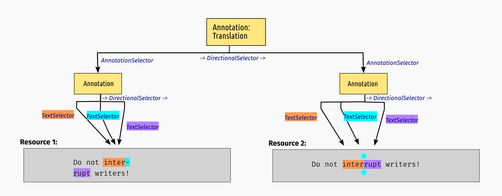

## Inleiding

1. **Wat is STAM?**
2. **Hoe gebruiken we STAM in Team Text?**
3. **Hoe kan STAM voor anderen nuttig zijn?**

## Wat is STAM?

1. Een **data model** voor het representeren van **annotatie** op **tekst**
    * op een **stand-off** manier
2. Een verzameling fundamentele **software tools** om met **stand-off annotatie** op **tekst** te werken

*Theorie* & *Praktijk* gaan hand in hand, STAM biedt de fundering waar je verder op kan bouwen.

**Project website: <https://annotation.github.io/stam>**

--------

--------

## Eigenschappen van het datamodel

* STAM is een **op-zichzelf-staand** model om annotatie op tekst uit te drukken.
* Het model is redelijk **minimalistisch** en uitbreiding zijn apart geformuleerd als **extensies**
    * Het kernmodel en extensies zijn vastgelegd in technische **specificaties** (onafhankelijk van implementatie)
    * Daarnaast zijn ze **geïmplementeerd** in onze tooling
* Het model is niet gebonden aan bepaald **vocabulaire** (de inhoud van de annotaties)
* Het is niet gebonden aan één bepaald bestandsformaat.

## Motivatie

Er was behoefte aan een simpel model met tooling om allerlei basale berekeningen te doen
die bij annotatie op tekst komen kijken.

* Hoe verhouden verschillende annotaties zich tot elkaar in de ruimte? (bv overlap)
* Hoe kan je snel en efficiënt zoeken in annotaties en in tekst?
* Omrekenen tussen verschillende relatieve en absolute coordinatensystemen
* Hoe implementeer je dit met efficiënt geheugengebruik

**Inspiratie:**

* *Text Fabric* (Dirk Roorda)
* *W3C Web Annotations*
* *FoLiA XML*

## Het kernmodel

--------

--------

----

## Implementaties & Interfaces

**Implementaties en interfaces**:

* `stam-rust`: een Rust library die het kernmodel en alle extensies implementeert.
* `stam-tools`: command line tools om met STAM te werken
    * unix principe:  één tool (subcommand) voor één ding
* `stam-python`: een Python-binding om `stam-rust` en `stam-tools`
    * handig voor ontwikkelaars en data scientists
* `stamd`: een webservice laag om `stam-rust` en `stam-tools`

**Voor wie?** Alle tools fungeren als **bouwstenen** voor een technisch publiek.

Alle implementaties zijn in Rust geschreven

## Wat doet Team Text ermee?

STAM vervult een belanrijke rol aan het begin van onze data-conversie pipeline:

met STAM tools ....

* ... **untanglen** we corpusdata in bv TEI of PageXML naar *plain text* en *stand-off annotaties* (`stam fromxml`)
* ... **normaliseren** we teksten (denk aan hyphenatie) (`stam translatetext`)
* ... **herberekenen** we annotaties op oorspronkelijke teksten naar annotaties op genormaliseerde teksten (`stam translate`)
* ... **exporteren** we annotaties naar **W3C Web Annotaties** voor *Annorepo* (`stam export`)
    * (de plain text gaar naar *Textsurf*)

-------------

In projecten als Globalize:

* ... **aligneren** we varianten van teksten (`stam align`)

-----

## Wat kan je er verder mee?

* Import en exportfunctionaliteit vanuit verschillende dataformaten
* Zoeken in tekst (`stam grep`) en tagging (`stam tag`)
* Uitgebreide query taal om te zoeken (**STAMQL**):

* Simpele HTML **visualisaties**:

* Validatie

## Conclusie

**STAM** ...

* ... biedt een **sterke generieke basis** waarom je verdere applicaties kan bouwen
        die iets doen met annotatie op tekst.
* ... is **modulair**; kies en gebruik de delen die je nodig hebt voor je taak
* ... is **flexibel**; jij kiest hoe je je data modelleert en brengt je **eigen vocabulaire** mee.
* ... regelt al **het rekenkundige basiswerk** zodat jij dat niet hoeft te doen
* ... biedt **interfaces** voor diverse *technische* **gebruikersgroepen**
* ... heeft een focus op **performance**, implementaties zijn in Rust geschreven
* ... is **open source software** (GNU General Public License v3) 
* ... > 40k regels Rust code, > 1500 ontwikkeluren, sinds january 2023
      (funding grotendeels via CLARIAH)

## Fin

**Verdere informatie:** Project website -- <https://annotation.github.io/stam>

* STAM Specificatie & Extensie specificaties
* Library API References (Rust & Python)
* Python tutorial "Standoff Text Annotation for Pythonistas"  (Jupyter Notebook)
* Screencast video voor stam-tools
* Poster
* Deze slides

