---
title: "STAM: Working with stand-off annotations on text"
author: Maarten van Gompel
institute: KNAW Humanities Cluster
fontsize: 11pt
urlcolor: blue
titlegraphic: ../presentation/logo.png
--- 

## Introduction

**What is STAM?**

1. A **data model** for **stand-off annotation** on **text**
2. A set of low-level **software tools** for working with  **stand-off annotation** on **text**

*Theory* & *Practise* go hand in hand, STAM aims to provide a *solid generic foundation upon which you can build*.

**Project website: <https://annotation.github.io/stam>**

--------


## Core Data Model

**What basic concepts and relations are needed to express stand-off annotation on text?**

* ... whilst keeping the concepts to a basic yet flexible enough **minimum** *(minimalism)*
    * ... **extensions** are formulated separately *(modularity)*
* ... without **dependencies** on other complex models *(standalone model)*
* ... without prescribing any domain-specific **vocabulary** *(separation from semantics)*
* ... not tied to any single **serialisation format** *(separation from syntax)*

STAM's **core model** is our answer to this.

* It is documented in a precise technical **specification** *(separation from implementation)*

--------

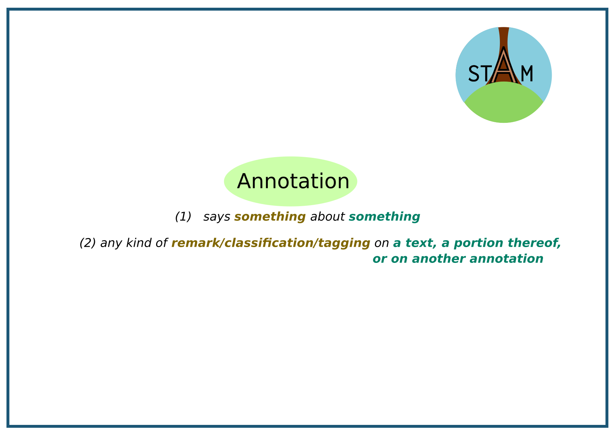

--------

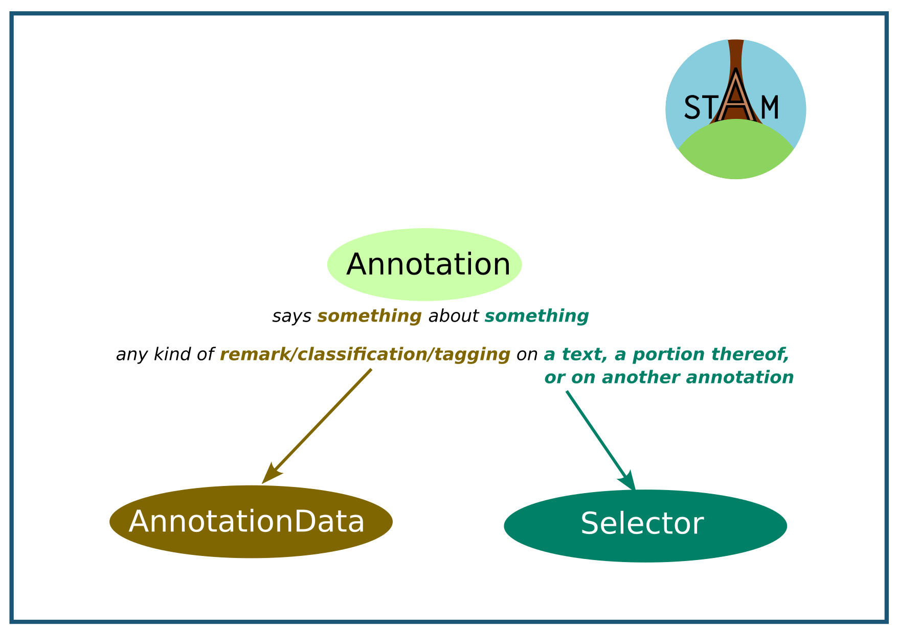

--------

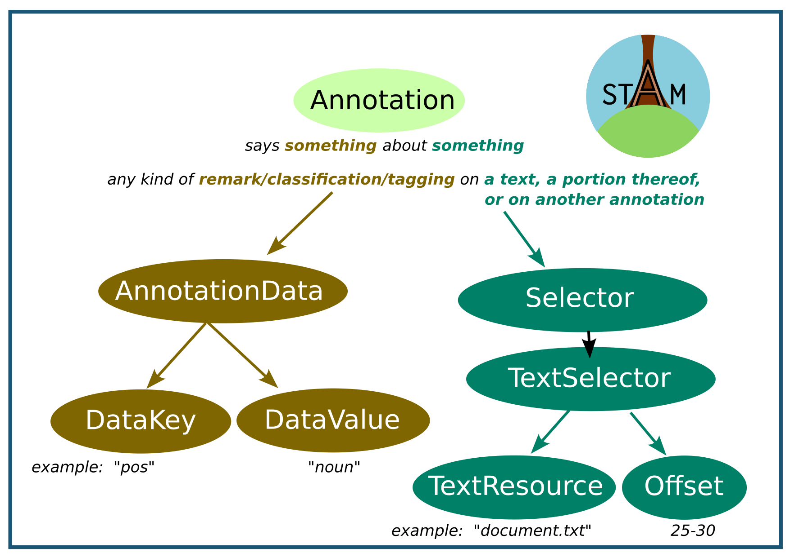

--------

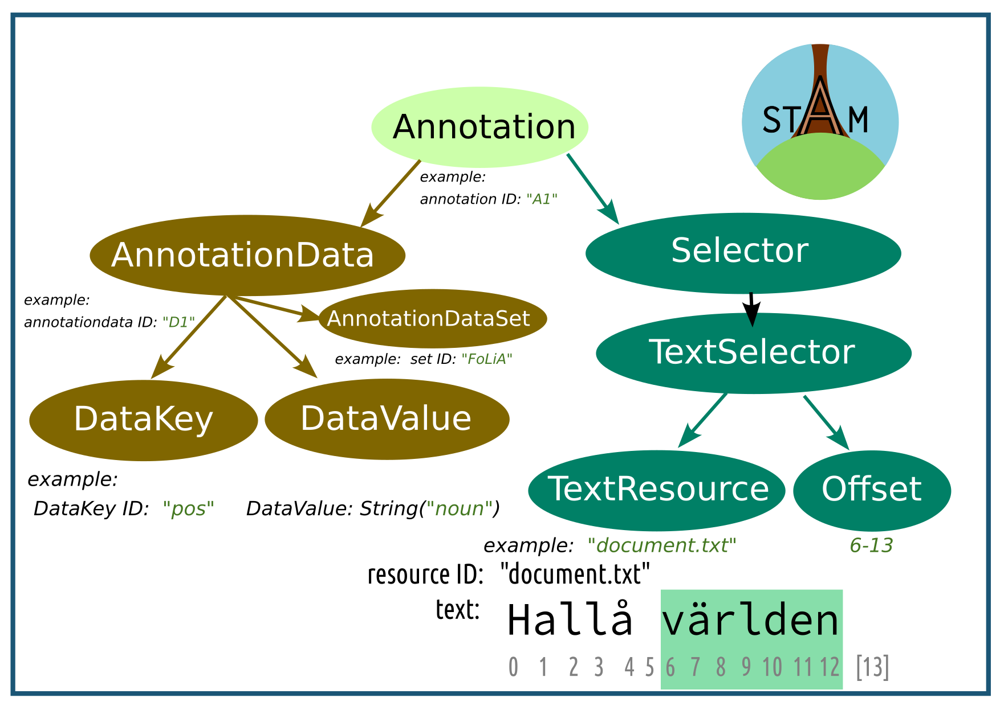

--------

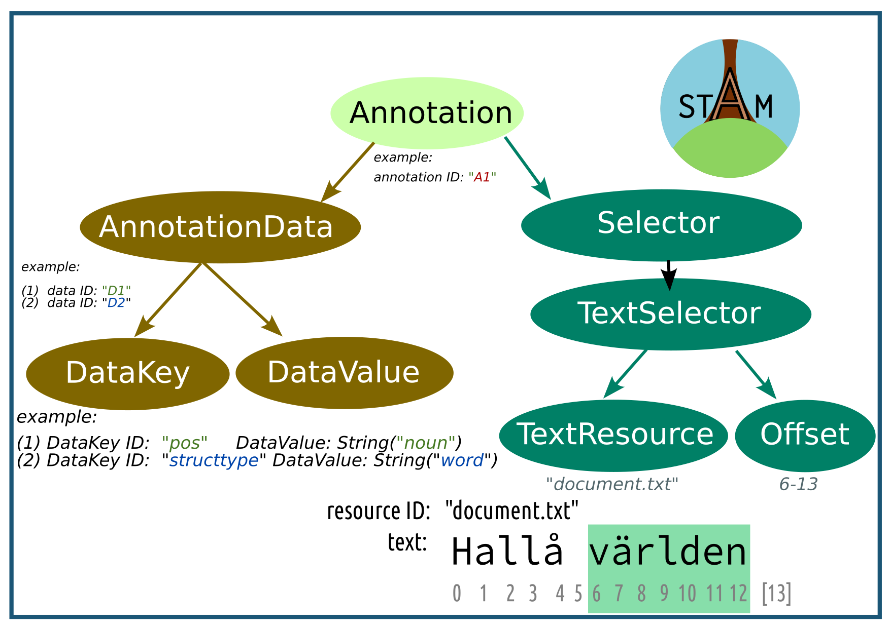

--------

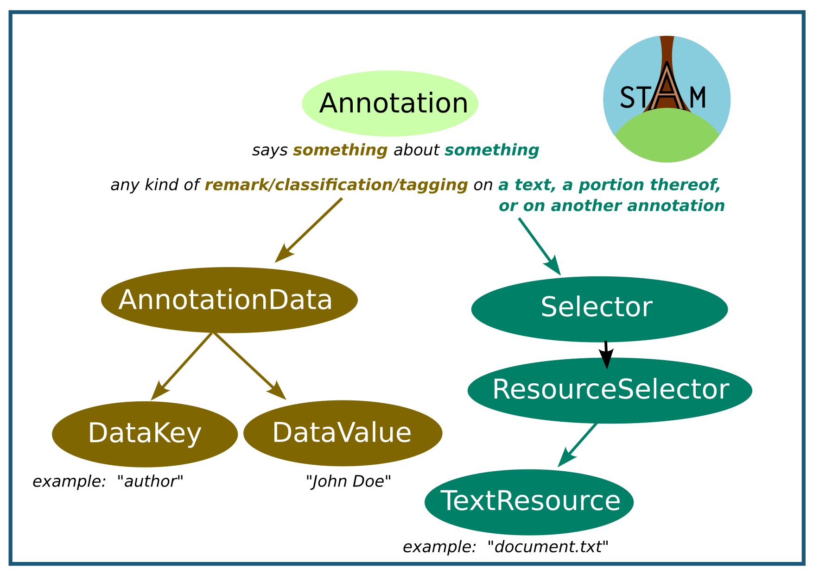

--------

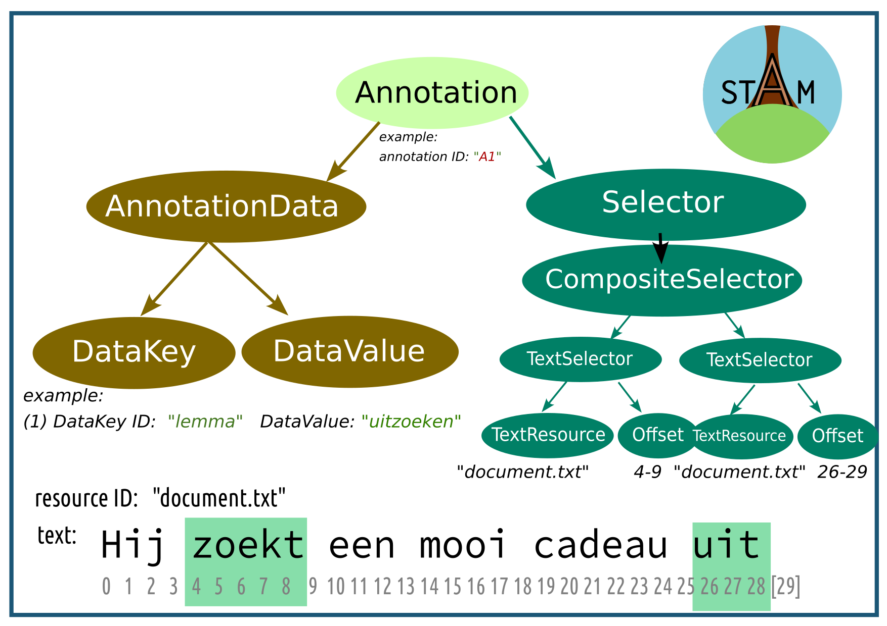

--------

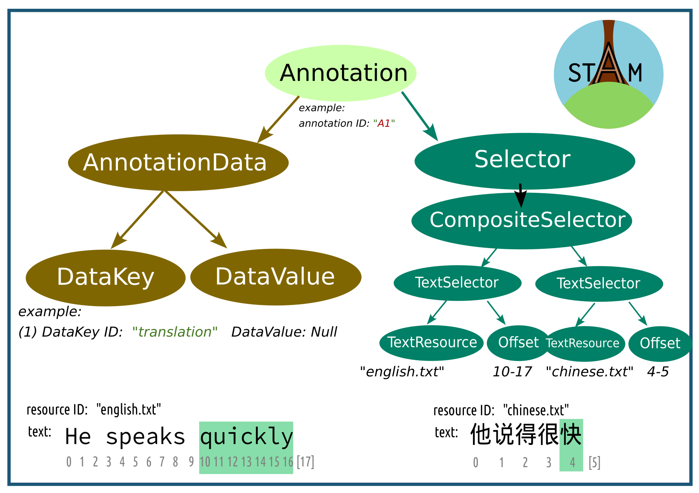

--------

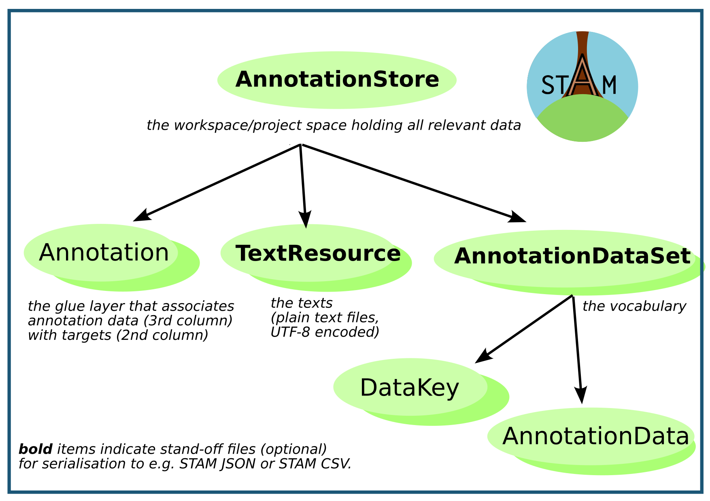

## Data Model Characteristics

**Technical**:

* Directed Acyclic Graph
* Annotations should be regarded as immutable
* Optimised for efficient memory use
* Optimised for (reverse) search indices
* Almost everything is an annotation

STAM offers a framework to build upon, not the full solution:

* You have to choose **how to model** your data using STAM
* You have to choose what **vocabulary** to use for your data

## Serialisation

|       | size | r/w speed | stand-off | readability | support |
| ----- | ---- | ------- | --------- | ----------- | -------- |
| JSON  | huge | normal | optional       | good        | canonical |
| CSV   | medium | normal | always    | good        | extension |
| CBOR  | small | fast | never     | bad         | implementation |

* *Stand-off*: Annotation Stores, Annotation Datasets, Text resources (plain text) can be stored in separate files.
* in the current STAM library (in-memory model), after parsing memory usage will be identical regardless of serialisation

-----

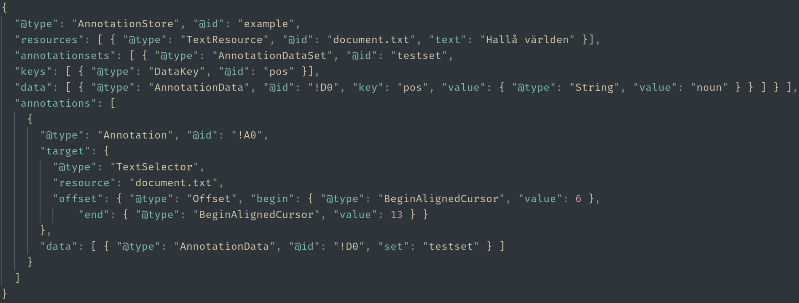


## Tooling

* focus on **performance**: efficient usage of computing resources (memory, cpu)
* focus on **reusability**: implement once, and re-use, core logic needed for annotations on text
* **standalone**: runs on a wide variety of systems and independent of any wider service infrastructure: does NOT depend on any software services.
* **accessibility**: clean APIs/CLIs and thoroughly documented

-----


## Implementations & Interfaces

**Reference implementations and their interfaces**:

* `stam-rust`: a high-performant library that implements the core model and all currently defined extensions
    * memory-based implementation, scalability constraints
    * reference implementation
* `stam-tools`: command line tools for working with STAM
    * unix principle: one tool (subcommand) for one thing
* `stam-python`: a Python-binding to stam-rust and stam-tools
    * good for technical data scientists
* `stamd`: STAM service offering a Web API

All target a technical audience and all are fully written in Rust (compiles to native machine code)

## Core functionality

The software library...

* ... exposes all concepts from the data model and holds data in memory efficiently
    * ... parses and serialises from/to disk
* ... allows editing data or creating it from scratch
* ... can retrieve texts for annotations, annotations for text, annotations for annotations
* ... can retrieve annotations based on *spatial* properties *(overlap, embedding, adjacency, proximity)*
* ... can retrieve annotations given annotation data (data indices)
* ... can search for text (regular expressions)
* ... can convert offset information between different reference frames
* ... can do validation

## Functionality from extensions

* **STAM Vocab** -- Express and validate against user-defined vocabularies
* **STAM Webannotations** -- Allows modelling W3C Web Annotations using STAM (full export support)
* **STAM Textvalidation** -- Adds an extra redundancy layer that helps protecting data integrity and aids readability of serialisations
* **STAM CSV** -- Tabular serialisation format
* **STAM Query Language (STAMQL)** -- A query language that allows end-users to formulate and subsequently execute searches on a STAM model.
* **STAM Transpose** - Links identical textual parts across resources, allows *transposition* of annotations from one to another.
* **STAM Translate** - Links non-identical parts of texts, allows *translation* of annotations from one to another.

All extensions have their **own specifications** *(separation from implementation)*

## Functionality in the tooling

### Import & Export

* **CSV/TSV** with custom column layout (``stam import``/``stam export``):
```
Text	part-of-speech	part-of-sentence
I	    pronoun	        subject
see  	verb	        main verb
you	    pronoun	        object
```
* **W3C Web Annotations**; JSON-LD (`` stam export``, *export only*)
* **XML** (``stam fromxml``, *import only*) -- *e.g. for TEI XML, PageXML, FoLiA XML* 
* **HTML** (``stam view``, *export only, visualisation*)

--------- 


-------------

### Querying

**STAMQL** is an *extensive* query language that exposes most functionality in the STAM
library:

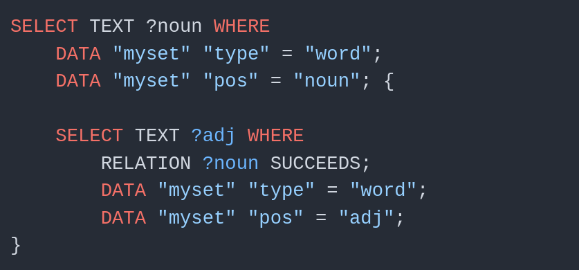

-----------

Querying and exporting often go hand-in-hand:


-------------

### Searching and tagging text

* **Searching text** (``stam grep``) -- Search for text (e.g. with regular expressions) and tag
* **Tagging** (``stam tag``) -- ... and tag matches as annotations!

-------------

### Alignment, Transposition & Translation

* **Alignment** -- (``stam align``) Align two similar texts (Smith-Waterman / Needleman-Wunsch)
    * *produces transpositions or translations*
* **Normalisation** -- (``stam translatetext``) Change a text based on simple rewrite rules 
    * *produces translations*
* **Translation & Transposition** -- Copy annotations from one text to another over a translation/transposition
    * ``stam translate`` & ``stam transpose``

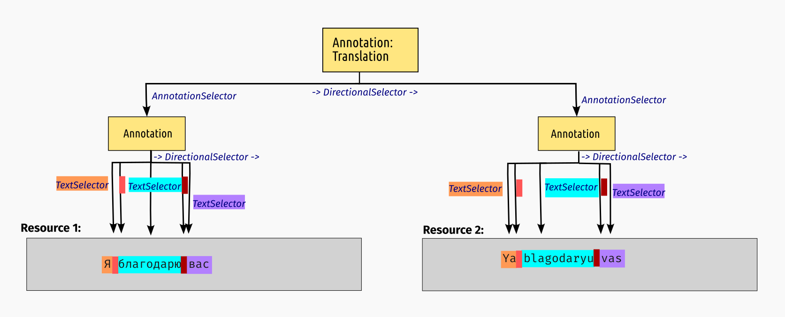

------

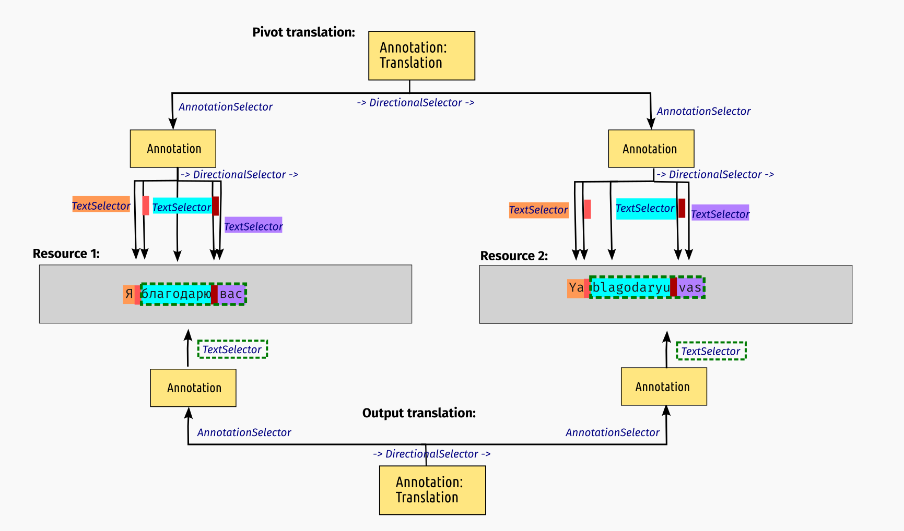

-------------

### Other functionality

* **Introspection** -- View the raw data in the model and its memory consumption
* **Merging and splitting annotation stores**
* **Validation**

## Conclusion

**Project website: <https://annotation.github.io/stam>**

**STAM** ... 

* ... offers a **solid generic foundation** upon which you can build higher-level applications
      for working with stand-off annotation on text
* ... is **modular**; pick and use the parts you need for your task
* ... is **flexible**; you decide how to model your data and bring **your own vocabulary**
* ... takes cares of the boring **computational groundwork** so you don't have to
* ... provides different **interfaces** for different **audiences**
* ... has focus on **performance** and implementations are written in Rust
* ... is **free open source software** (GNU General Public License v3) and
  open to contributors.
* ... has had well over 1500 development hours since january 2023
      (in part funded by CLARIAH)


