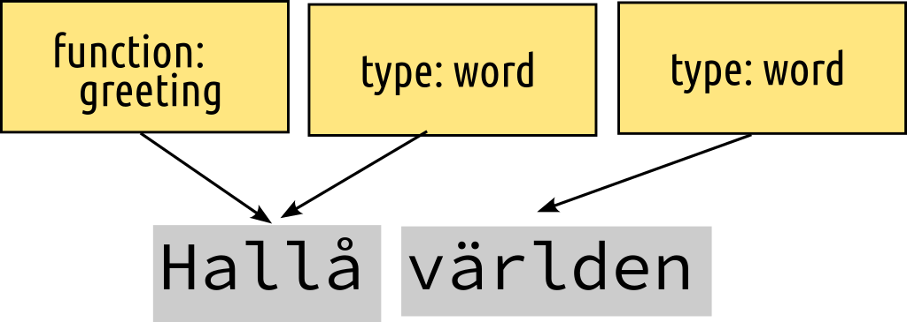
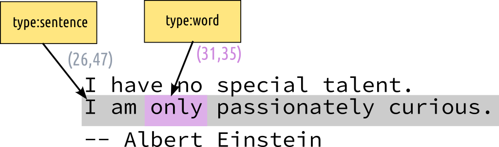
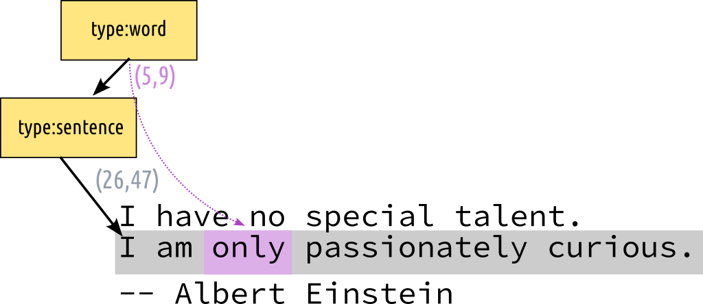
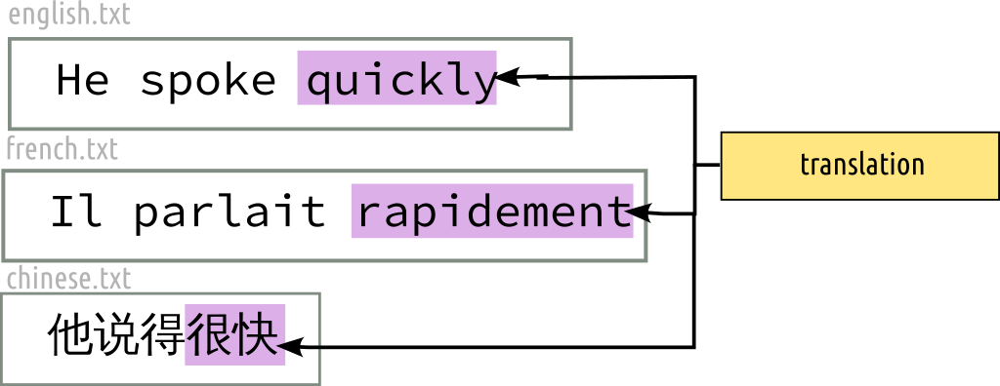
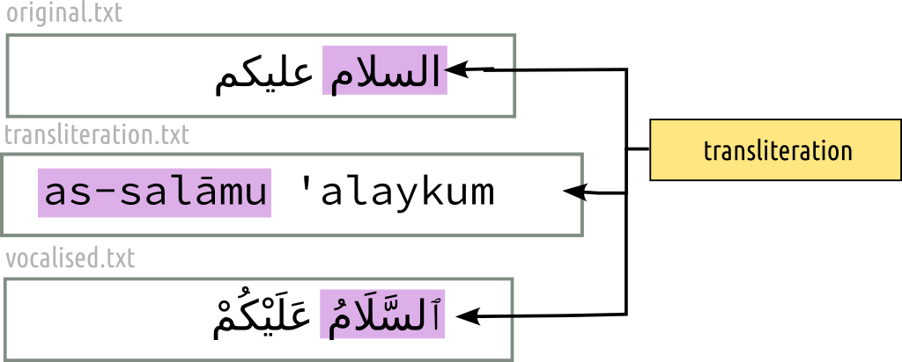
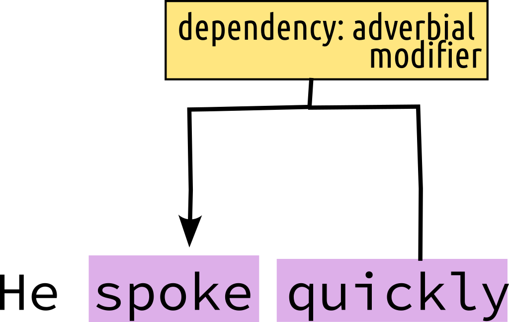
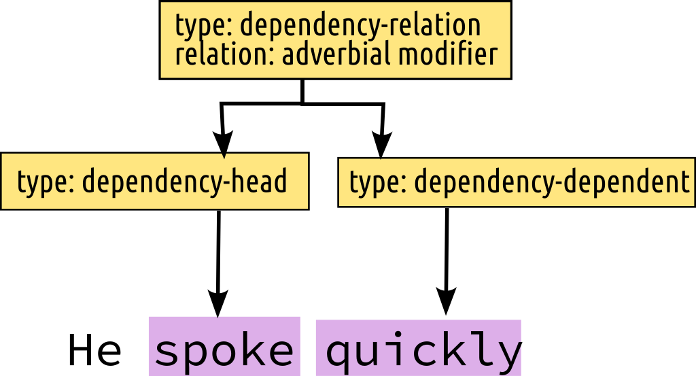
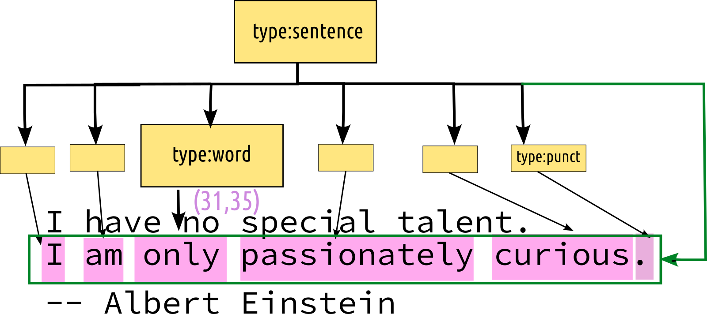

# Examples

## Example A

Example A shows a textual resource with a small Swedish text *"Hallå världen"* with tree annotations (shown in yellow)

None of the vocabulary in the (yellow) annotations is predefined by STAM.

After working this out in the STAM annotation model, we obtain the schema
below. Note that two annotations share the same data, illustrating how the
model leads to more memory efficiency.

## Metadata

This example shows an annotation on an entire resource (using
`ResourceSelector`), rather than on a particular part of the text.
Such annotations can be interpreted as metadata.

## Implicit containment

This example shows implicit containment and absolute offsets Targeting a short
text, it annotates the second sentence of the text, and the third word in that
sentence. Because one annotations is inside the other, we speak of implicit
containment.

## Explicit containment and relative offsets

This example shows how you can model explicit containment and relative offsets
using higher-order annotations. Targeting a short text, it annotates the second
sentence of the text, and the third word in that sentence (relative).

The vocabulary is ad-hoc and (implicitly) lumped into one
annotation data set. The JSON serialisation uses inline annotations.

* [text resource](explicit_containment.txt)
* [STAM JSON](explicit_containment.json)

Explicit containment with relative offsets can always be automatically
converted to implicit containment and absolute offsets, the reverse is
also possible *except* when two annotations overlap
precisely. Extra information about hierarchy would then be needed to resolve
the situation.

## RDF constraints

This example builds on the previous one and shows how to make a STAM model
comply to the constraints needed for RDF. Vocabularies are no longer ad-hoc but
specific:

* `rdf:type` is used to denote the annotating type here
* the value of the type itself uses the [NIF 2.0](https://persistence.uni-leipzig.org/nlp2rdf/) vocabulary

* [text resource](explicit_containment.txt)
* [STAM JSON](explicit_containment_rdf.json)

## Multiselector

This example shows how the ``MultiSelector`` can be used. Here we use a ``MultiSelector`` that has two ``TextSelectors`` to
select and annotate a non-contiguous part of the text:

## Multiselector for multiple resources (1)

A `MultiSelector` is not constrained to have only `TextSelector`s, nor are the
`TextSelector`s constrained to point to the same resource. consider the
following example where we have three text resources in different languages and
single annotation that marks a translation relation of a certain part in all of them:

In this example we also show that the annotation data need not always consist of a key/value pair, it may choose either and leave the other empty.

## Multiselector for multiple resources (2)

This example shows an analogous annotation to the above, and relates multiple variants of the same text together (in different resources):

## Directional selector

This example shows how the ``DirectionalSelector`` can be used. Here we use a
``DirectionalSelector`` that has two ``TextSelectors``, the first points to the
word *quickly* and the second points to the word *spoke*. The annotation marks
a dependency relation (adverbial modifier).

## Multiselector and explicit containment (grouping annotations)

This illustrates a similar annotation scenario as above, but here we do without
the directional selector and show how you can use higher-order annotations and
a multiselector to group multiple annotations:

Let's now consider a following variant of our earlier example [explicit
containment and relative offsets](#explicit_contaiment_and_relative_offsets).
Where we had a sentence annotation and on top of that we had word annotation(s)
which referenced the sentence via relative offsets. We can also model this the
other way around: first we have word annotations and then we model the sentence
on top of words with a `MultiSelector` consisting of `AnnotationSelector`s. The words come first, referencing the
text, and the sentence now explicitly links to all the words that are contained
within it. The sentence either may not refer to the text at all anymore, or we add a `TextSelector` to the `MultiSelector` to point to the sentence (the green arrow).

Note that in this scenario, there are no relative offsets anymore. We show
these multiple variants to illustrate that STAM is capable of expressing
various annotation paradigms. It's up to users to determine what model fits
best for their use case.

At this point I also want to emphasise that the simplified schemas drawn here
do not show the space-conserving features of the STAM model. In this example we
saw seven annotations, but behind that are only three `AnnotationData`
instances and only one `DataKey` (type).

