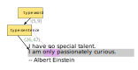
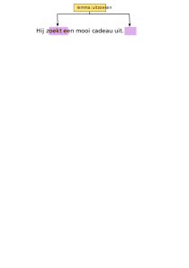
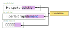
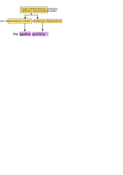

# Examples

## Example A

Example A shows a textual resource with a small Swedish text *"Hallå världen"* with tree annotations (shown in yellow)

None of the vocabulary in the (yellow) annotations is predefined by STAM.

After working this out in the STAM annotation model, we obtain the schema
below. Note that two annotations share the same data, illustrating how the
model leads to more memory efficiency.

## Implicit containment

This example shows implicit containment and absolute offsets Targeting a short
text, it annotates the second sentence of the text, and the third word in that
sentence. Because one annotations is inside the other, we speak of implicit
containment.

## Explicit containment and relative offsets

This example shows how you can model explicit containment and relative offsets
using higher-order annotations. Targeting a short text, it annotates the second
sentence of the text, and the third word in that sentence (relative).

The vocabulary is ad-hoc and (implicitly) lumped into one
annotation data set. The JSON serialisation uses inline annotations.

* [text resource](explicit_containment.txt)
* [STAM JSON](explicit_containment.json)

Explicit containment with relative offsets can always be automatically
converted to implicit containment and absolute offsets, the reverse is
also possible *except* when two annotations overlap
precisely. Extra information about hierarchy would then be needed to resolve
the situation.

## RDF constraints

This example builds on the previous one and shows how to make a STAM model
comply to the constraints needed for RDF. Vocabularies are no longer ad-hoc but
specific:

* `rdf:type` is used to denote the annotating type here
* the value of the type itself uses the [NIF 2.0](https://persistence.uni-leipzig.org/nlp2rdf/) vocabulary

* [text resource](explicit_containment.txt)
* [STAM JSON](explicit_containment_rdf.json)

## Multiselector

This example shows how the ``MultiSelector`` can be used. Here we use a ``MultiSelector`` that has two ``TextSelectors`` to
select and annotate a non-contiguous part of the text:

## Multiselector for multiple resources

A `MultiSelector` is not constrained to have only `TextSelector`s, nor are the
`TextSelector`s constrained to point to the same resource. consider the
following example where we have three text resources in different languages and
single annotation that marks a translation relation of a certain part in all of them:

In this example we also show that the annotation data need not always consist of a key/value pair, it may choose either and leave the other empty.

## Directional selector

This example shows how the ``DirectionalSelector`` can be used. Here we use a
``DirectionalSelector`` that has two ``TextSelectors``, the first points to the
word *quickly* and the second points to the word *spoke*. The annotation marks
a dependency relation (adverbial modifier).

## Multiselector and grouping annotations

This illustrates a similar annotation scenario as above, but here we do without
the directional selector and show how you can use higher-order annotations and
a multiselector to group multiple annotations:

(This mirrors the way paradigms such as FoLiA handle dependency relations)

