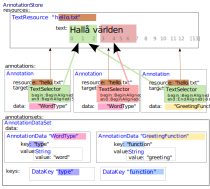

# Examples

## Example A

Example A shows a textual resource with a small Swedish text *"Hallå världen"* with tree annotations (shown in yellow)

None of the vocabulary in the (yellow) annotations is predefined by STAM.

After working this out in the STAM annotation model, we obtain the schema
below. Note that two annotations share the same data, illustrating how the
model leads to more memory efficiency.

## Implicit containment

This example shows implicit containment and absolute offsets Targeting a short
text, it annotates the second sentence of the text, and the third word in that
sentence. Because one annotations is inside the other, we speak of implicit
containment.

## Explicit containment and relative offsets

This example shows how you can model explicit containment and relative offsets
using higher-order annotations. Targeting a short text, it annotates the second
sentence of the text, and the third word in that sentence (relative).

The vocabulary is ad-hoc and (implicitly) lumped into one
annotation data set. The JSON serialisation uses inline annotations.

* [text resource](explicit_containment.txt)
* [STAM JSON](explicit_containment.json)

## RDF constraints

This example builds on the previous one and shows how to make a STAM model
comply to the constraints needed for RDF. Vocabularies are no longer ad-hoc but
specific:

* `rdf:type` is used to denote the annotating type here
* the value of the type itself uses the [NIF 2.0](https://persistence.uni-leipzig.org/nlp2rdf/) vocabulary

* [text resource](explicit_containment.txt)
* [STAM JSON](explicit_containment_rdf.json)

