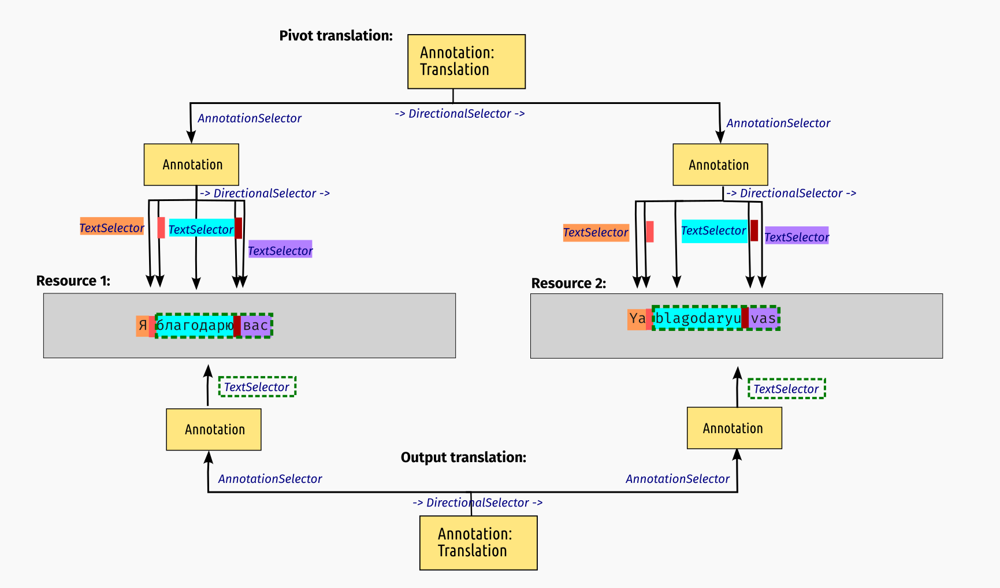

# STAM-Translate: Linking related text selections

## Introduction

This is an extension on top of STAM that allows linking arbitrary textual parts
(including across resources), which we call *translation*. This extension defines a
vocabulary and prescribes functionality enabled through this vocabulary. This
extension does not alter the underlying core data model.

This is a more generic variant of the [STAM transpose](../stam-transpose/) extension.
Whereas, transposition defines an exact mapping between two or more identical text selections, translations
are texts that are somehow related but where the textual content is not identical.
We use this term in a wide definition, so it covers not just natural language translation, but also things like
transliteration, text normalisation, spelling correction, etc.. 

The key words "MUST", "MUST NOT", "REQUIRED", "SHALL", "SHALL NOT", "SHOULD",
"SHOULD NOT", "RECOMMENDED", "MAY", and "OPTIONAL" in this document are to be
interpreted as described in RFC 2119.

## Vocabulary

A **translation** is, like everything in STAM, just an annotation. Annotations
that describe translations are explicitly marked as being a translation by
carrying the following key in the annotation dataset with identifier
``https://w3id.org/stam/extensions/stam-translate/``:

* `Translation` (type: `Null`) - Marks an annotation as being a translation. A translation *MUST* either:
    * use a `DirectionalSelector` or `CompositeSelector`, with underneath a `TextSelector` to target two or more text selections directly. 
    * use a `DirectionalSelector` or `CompositeSelector`, with underneath an `AnnotationSelector` to target two or more annotations. We call this this *complex translation*.

In case the translation is a natural language translation, this extension
*RECOMMENDS* the use of the following key to identify the language:

* `lang` (type: `String`) - The value *MUST* be an [iso-639-3 language code](https://iso639-3.sil.org/code_tables/639/data).

The use of `DirectionalSelector` vs `CompositeSelector` under the translation itself is a small semantic
distinction without real functional implications. Use of `DirectionalSelector`
here implies an explicit source to target ordering so you can distinguish which was
the original and which the derived copy.

The complex translation is called *complex* because the annotations targeted by
the underlying `AnnotationSelector` *MAY* themselves have a *complex selector*
(`DirectionalSelector`, `CompositeSelector` or `MultiSelector`). In this case,
the complex selectors on either side *MUST* describe the same number of text
selections.  Unlike is the case in [transpositions](../stam-transpose/), the
text targeted by these text selectors does not have to be the same, and *MAY*
even be zero-width in case of deletions/insertions, as will be shown later.

The following schematic illustrates a simple form of translation, where resource 1 
is a Russian sentence in cyrillic script, and resource 2 is a transliteration in latin script.

The above example covers only one word, we can cover the whole sentence with a
complex translation as follows:

To really cover the whole sentence it would be a good idea to also map the
spaces between the words separately, which is represented by the text
selections in a reddish shade above. Mapping the full text in as small units as
possible makes it more likely that any other annotations can later be
translated from one resource to the other. More on this later.

### Insertions and Deletions

Translations, unlike transpositions, can be used to explicitly map insertions and
deletions. Recall that the number of text selectors on either side of the
transposition *MUST* be the same. This may seem to exclude the possibility of
doing insertions and deletions, where the number of fragments is not the same.
However, there is an elegant solution to this using zero-width text selectors, i.e.
text selectors that have the same begin and end position and thus do not select
any actual text but merely correspond to a position in the text.

This is illustrated in the following example, a case of text normalisation,
where we have a hyphenation character *and a newline character* in resource 1,
and none of those in resource 2:

If you perceive this in the direction from resource 1 to resource 2, this is a
deletion. If you perceive it in the opposite direction, it is an insertion. As
we use a `DirectionalSelector` instead of a `CompositeSelector`, the first
reading is emphasised.

## Functionality

STAM implementations implementing this extension *MUST* provide the following functionality:

* A translate function that maps text selection(s) or annotation(s) (that refers to text selection(s)) over a (third) translation annotation (also called the pivot). This effectively translates items in one coordinate system to another.
    * The function *MUST* produce translated text selection(s)/annotation(s) as output.
    * This function *MUST* itself be able produce a translation as its output (linking to the above output), this effectively links to two text selections/annotations and is useful at least for keeping provenance information intact. The user *SHOULD* be able to ignore this output if not deemed needed for his/her use-case. The function *SHOULD* also be able to output an additional resegmentation if resegmentation is necessary. (explained in the [STAM transpose](../stam-transpose) documentation).
    * Translating text selections or annotations can not be done for any arbitrary text selection/annotation as they can for transpositions. The following constraints *MUST* be satisfied for a translation to work:
        * The text selection that is being translated *MUST* fully cover one or more text selections on the source side of the translation pivot. This implies that is must begin and end at established boundaries and *MUST NOT* intersect a text selection on the source side.
    * Translating text selections or annotations is not possible if parts of the text selection(s)/annotation(s) are not covered by the translation. In such cases the translate function *MUST* reject operation with an error.
    * Zero-width text selections *MUST* be supported, annotations that target second on one side but are zero-width on the other side are allowed.
    * The pivot annotation *MUST* be a *complex translation*. Translating over a simple translation is a no-op as that would by definition produce the pivot itself as output.

An example will illustrate all of this further:

Assume we have the same translation as we saw before. This is our pivot translation. Then assume we have an additional annotation on "благодарю вас" on resource 1, showed in dashed green box in the schema below. Via the translate function we should now be able to translate this annotation from resource 1 to resource 2 (the same logic also holds in the other direction) and get an annotation on "blagodaryu vas", along with a new output translation that records the mapping. The following schema illustrates this:

In the above translation, the fine-grained segmentation is lost on the output side, but this produces simpler annotations that 
relate the source annotation directly to its new target, which may be preferable in many use-cases. Implementations, however, *MUST* also support maintaining the exact segmentation as shown in the next schema. In such cases, an extra resegmentation (as explained in the [STAM transpose](../stam-transpose) documentation) annotation may be needed to map the actual input annotation to the source side of the translation. This is not depicted in this schema.

To understand the limitations of these translations; consider a linguist placed an annotation on the morpheme "ю" (this indicates first person singular on a certain class of verbs). Can they now automatically translate this annotation to the transliterated resource 2 using the same translation pivot and the translate function? The answer here is no, as we can only perform translations if the source annotation matches one of more contiguous text selections on the source-side of the translation. The current pivot translation lacks the fine-grained information needed to translate that morpheme.

From this our earlier point follows: the finer-grained the text selections are,
the more likely it is that later annotations can be translated.

STAM implementations implementing this extension a *MAY* implement
functionality that allows one text to be transformed into another, parametrised
by translation rules (not further specified), and produces translation
annotations as a result.
