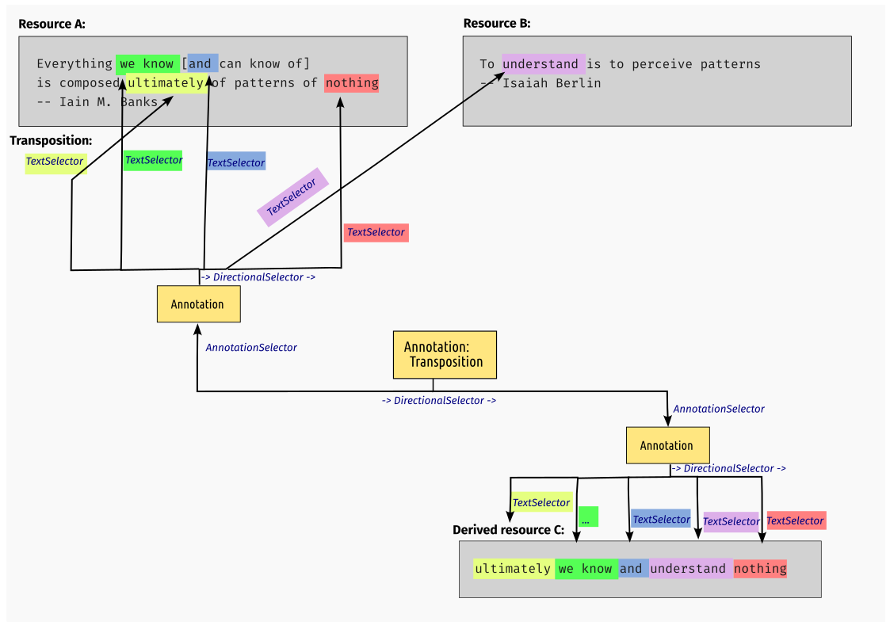
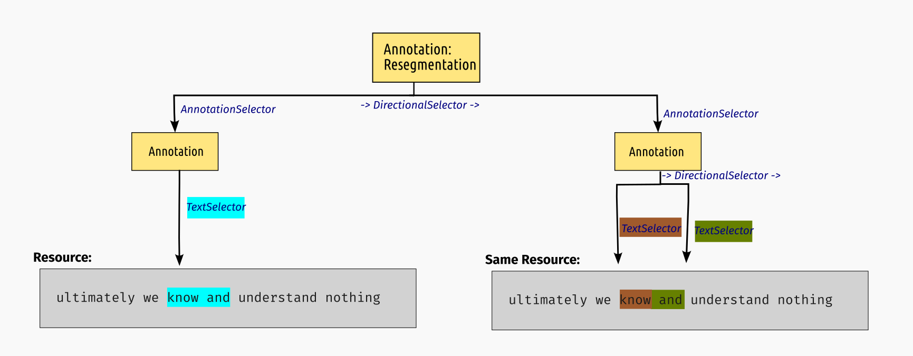
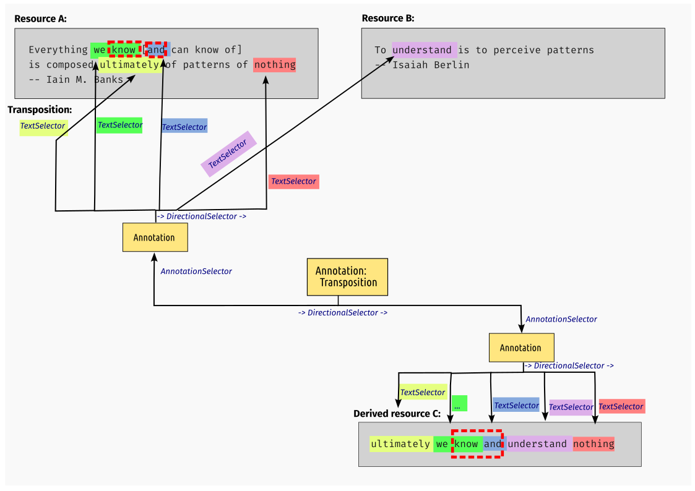
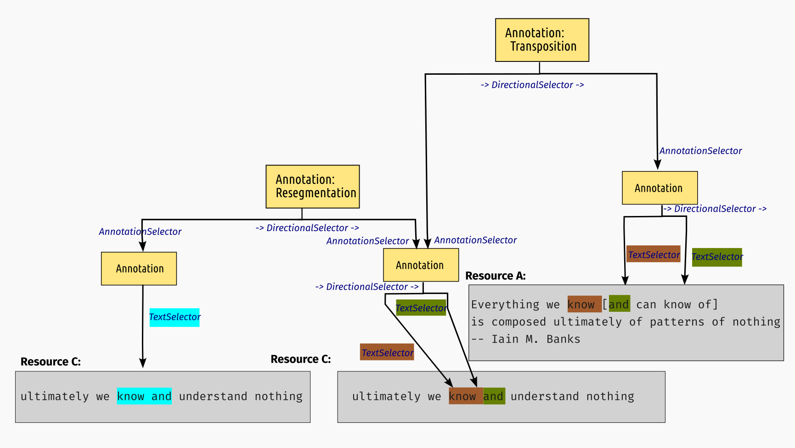

# STAM-Transpose: Linking identical text selections

## Introduction

This is an extension on top of STAM that allows linking identical textual parts
(including across resources), which we call *transposition*. This extension defines a
vocabulary and prescribes functionality enabled through this vocabulary. This
extension does not alter the underlying core data model.

Transposition defines an exact mapping between any text selections. It can for
instance be used as the foundation to derive a new text resource from one or
more existing resources. 

In simple terms, you can compare this to copy/pasting
parts of one or more text resources into a new text resource. We call these **derived resources**.
The transposition is an annotation that covers both the source and target resource(s) and defines
precisely which text selections were copied where. This enabled various transformations and use cases:

* Leaving out unwanted parts of a text
    * *Use-cases:* Think of page numbers, headers, metadata blocks, non-textual/structured data, censorship
* Inserting comments/notes in a redacted text:
    * *Use-cases:* Explicit text annotation where annotation is explicitly expressed in the text.
* Re-ordering text selections
    * *Use-cases*: Changing reading order, column rearrangement, footnotes, marginalia, notes per page to notes per chapter/document.
* Concatenate text selections
    * *Use-cases:* Citation, summarisation

In all these cases, text selections from one or multiple resources are
recombined into a new derived resource. The transposition defines this
relationship.

In STAM, each resource has its unique
1-dimensional coordinate space in unicode points, the transposition enables implementations
to map coordinate systems.

The key words "MUST", "MUST NOT", "REQUIRED", "SHALL", "SHALL NOT", "SHOULD",
"SHOULD NOT", "RECOMMENDED", "MAY", and "OPTIONAL" in this document are to be
interpreted as described in RFC 2119.

## Vocabulary

A **transposition** is, like everything in STAM, just an annotation. Annotations
that describe transpositions are explicitly marked as being a transposition by
the following key in the annotation dataset with identifier
``https://w3id.org/stam/extensions/stam-transpose/``:

* `Transposition` (type: `Null`) - Marks an annotation as being a transposition. A transposition *MUST* either: 
    * use a `DirectionalSelector` or `CompositeSelector`, with underneath a `TextSelector` to target two or more text selections directly. We call this the *simple transposition*. The text selections on either side *MUST* have the exact same *textual content*. 
    * use a `DirectionalSelector` or `CompositeSelector`, with underneath an `AnnotationSelector` to target two or more annotations. We call this this *complex transposition*. The text targeted by the annotations *MUST* be identical on either side. The annotations themselves 

The full notion of transposition is illustrated in the following schematic, where resource A and B are recombined into a derived resource C:

The use of `DirectionalSelector` vs `CompositeSelector` under the transposition itself is a small semantic
distinction without real functional implications. Use of `DirectionalSelector`
here implies an explicit source to target ordering so you can distinguish which was
the original and which the derived copy.

The complex transposition is called *complex* because the annotations targeted
by the underlying `AnnotationSelector` *MAY* themselves have a *complex
selector* (`DirectionalSelector`, `CompositeSelector` or `MultiSelector`). In
this case, the complex selectors on either side *MUST* describe the same number
of text selections with the exact same textual content on either side, which
implies that both selectors as a whole describe the same textual content. In all cases, target annotations on either side of the transposition *MUST* have the same selector type.

Transposition can also be used to re-order text. Transpositions that re-order
multiple text selections (i.e. place text selection B' before A' whereas A was
before B in the source) *MUST* use a `DirectionalSelector`. This implies that
the textual reading of the annotation as a whole is identical on both sides
because a `DirectionalSelector` implies how text is concatenated. That the
directional order is then non-sensical from a human reading perspective on at
least one side of the transposition not an issue, it merely serves as a
mapping between the coordinate spaces.

A **derived resource** is defined as a resource where all text is derived from
the text of one or more other resources for which the full resource text is
covered by *a single* (often complex) transposition. To explicitly mark a
resource as a derived resource, which is *RECOMMENDED*, we define the following
key in ``https://w3id.org/stam/extensions/stam-transpose/``:

* `DerivedResource` (type: `Null`) - Marks an annotation as defining a derived
  resource. The annotation *MUST* have a `DirectionalSelector` with (in this
  order) a `ResourceSelector` and `AnnotationSelector` underneath. The
  `ResourceSelector` point to the resource that is derived, and the
  `AnnotationSelector` points to the transposition that defines how it is
  derived from which sources.

Though transposition across two text resources and the creation of derived
resources is a common use-case, transposition is not limited to that; it *MAY*
also be used to link identical text selections within a single resource.
Likewise, you *MAY* also cover more than two text resources. Text selections
*MAY* be sourced from multiple heterogeneous resources rather than all from a
single one.

### Resegmentation

The STAM Transpose extension also defines **resegmentation**, because it is
prerequisite for some types of transposition, as will be illustrated later. A
resegmentation maps two instances of the exact same text (on the exact same
resource), but redefines how the text is segmented into text selections.

We introduce the following key in the set ``https://w3id.org/stam/extensions/stam-transpose/``:

* `Resegmentation` (type: `Null`) - An annotation that *MUST* use a
  `DirectionalSelector` or `CompositeSelector` with underneath two
  `AnnotationSelector`s to target two or more annotations. These annotations
  *MUST* all target the exact same text, in the same order, in the same resource(s) (using another
  `DirectionalSelector`, `CompositeSelector` or directly using `TextSelector`), but can cover the same text using different text selections. The complex selectors at these level *MAY* have a different
  number of text selections on each side and unlike in transpositions, no one-to-one
  relation is presumed between these items.

The following image illustrates resegmentation:

## Functionality

STAM implementations implementing this extension *MUST* provide the following functionality:

* A transpose function that maps any arbitrary text selection(s) or annotation(s) (that refers to text selection(s)) over a (third) transposition annotation (also called the pivot). This effectively translates items in one coordinate system to another.
    * The function *MUST* produce transposed text selection(s)/annotation(s) as output.
    * This function *MUST* itself be able produce a transposition as its output (linking to the above output), this effectively links to two text selections/annotations and is useful at least for keeping provenance information intact. The user *SHOULD* be able to ignore this output if not deemed needed for his/her use-case. The function *SHOULD* also be able to output an additional resegmentation if resegmentation is necessary. (explained at the end of this section)
    * Transposing text selections or annotations is not possible if parts of the text selection(s)/annotation(s) is not covered by the transposition. In such cases the transpose function *MUST* reject operation with an error.

To illustrate the transpose function on the basis of the schema shown earlier, assume we select the text selection *"know and"* in the derived resource C, we use red dashed lines to mark this in the next schema:

We then intend to transpose this selection back to source resource A. The
transpose function takes the transposition that formed the derived resource as
a parameter, and based on that information it knows to first map our single
text selection in resource C to two text selections in the same resource C
(because there is a colour change in the middle): one picks a slice of the
green text selection, and one picks a slice of the blue text selection. Because
both text selections are mapped from resource A, the transpose function knows
it can produce valid output in resource A and will yield two text selections
there. Note that in resource A these are not directly adjacent (there is a
square bracket in between), but that does not hinder our ability to map the
text selection.

The result of this transpose operation is a new transposition with two annotations
underneath, one pointing at *"know "* and *"and"* in resource C, and the other
pointing at *"know "* and *"and"* in resource A.

Note that if we were to select the text selection *"and understand"* (blue and
purple) in resource C, then the transpose function needs to fail if we ask it
to map it to only either resource A or B. It can only succeed if we allow it to
map freely to both resources, which *MUST* be allowed as well by the transpose
function. Similarly, if we select *"Everything we know"* (uncoloured and green)
in resource A and ask to transpose it to resource C, then that too would fail
because "Everything" is not part of the transposition that created resource C.

We go back to our example of transposing "know and" from resource C to resource
A now. If possible, the transposition that is produced *SHOULD* reference the
original annotation as one of its sides (e.g. as one of the annotations in its
complex selector). However, this is not always possible, as this particular
example illustrates: If the original annotation references the text "know and"
in resource C as a single text selection, it can by definition of how
transpositions are defined not map two text selections on the other side
(an exact one-to-one mapping between items in the complex selector of a
transposition is *REQUIRED*). Although these type of transpositions *MUST* be
supported, we then end up with a situation where the original annotation can
not be directly used as one of the sides of the transposition. The annotation
that is suitable for use as a side in the transposition instead is a so-called
*resegmented* variant (i.e. a side in a *resegmentation*, the other side is the
original source annotation). This is illustrated in the following schema in
which the annotation on the bottom-left would be the original annotation, the
one in the middle the resegmented variant, and the one on the right the
transposed variant:

## Limitations

Transposition is by definition limited to relating text selections whilst
preserving their textual content unmodified. It *MUST NOT* be used in cases
where you want to relate text selections of a different nature, such as
translations, transliterations, normalisations or corrections. Use
[translations (STAM-translate extension)](../stam-translate/README.md) for those.
